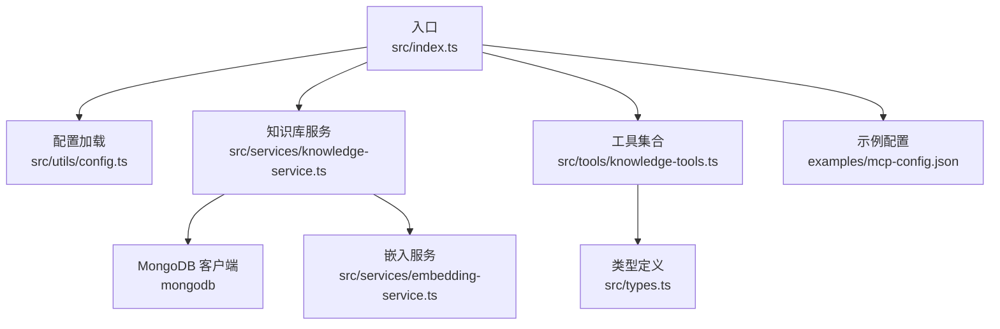
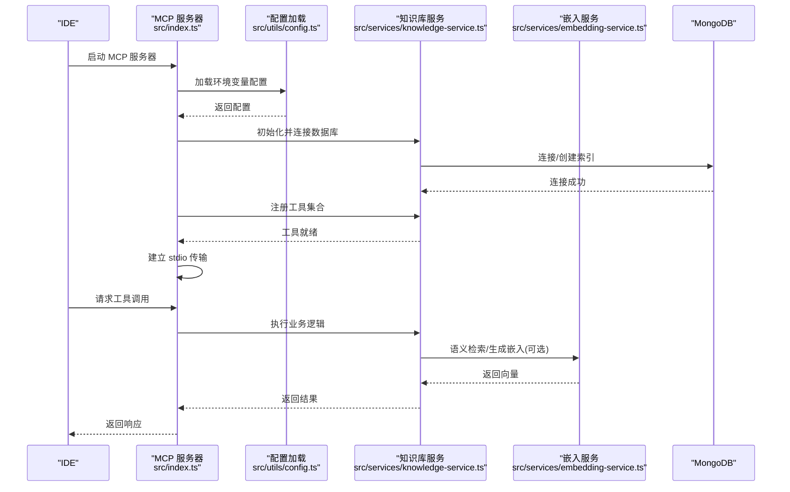
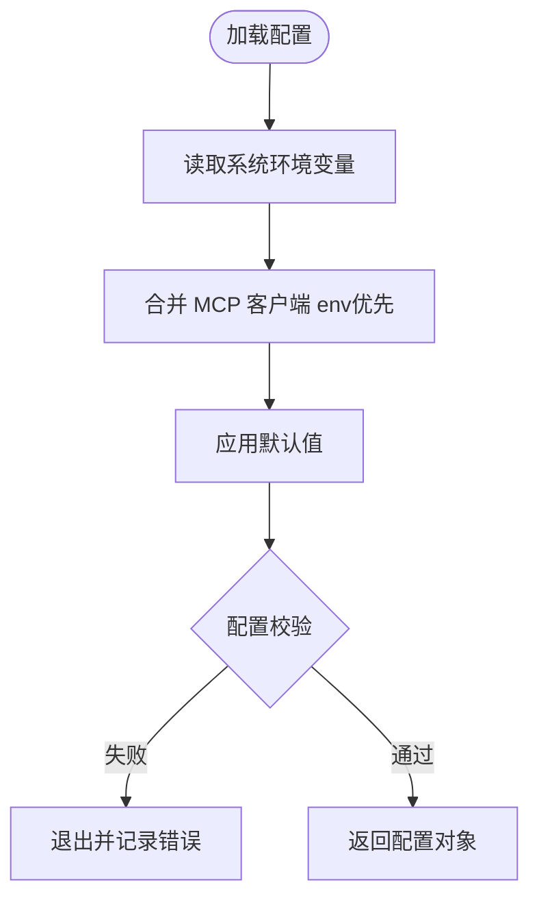
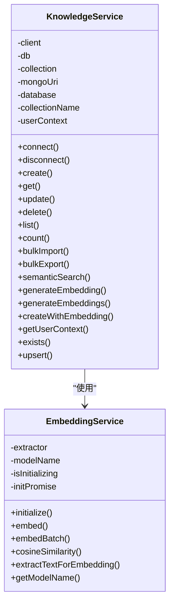
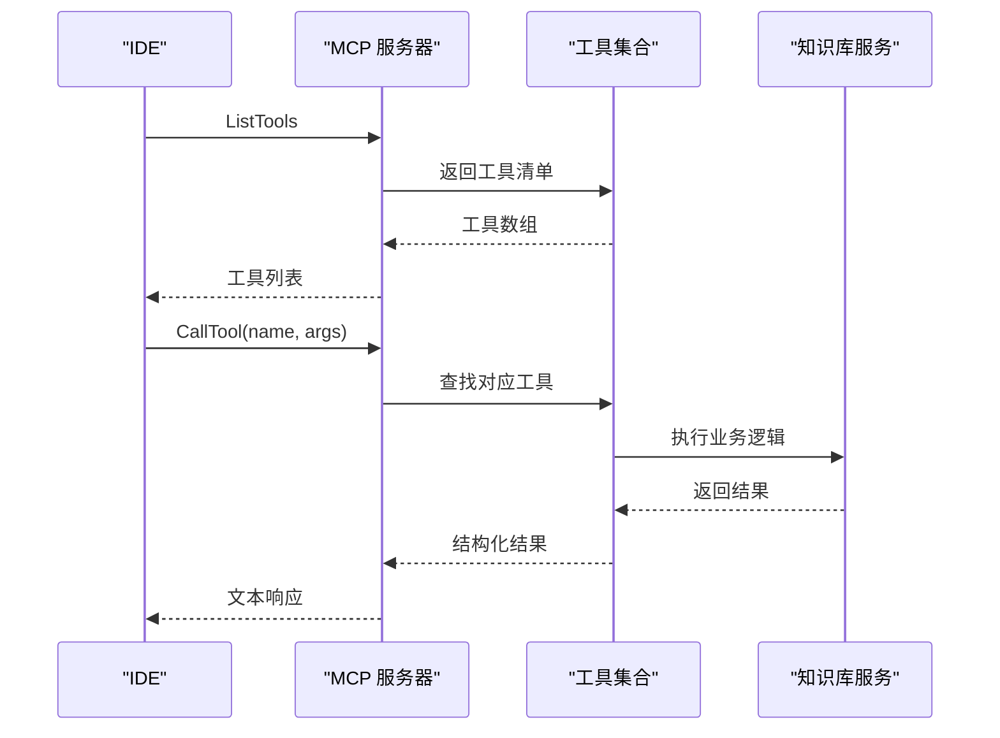
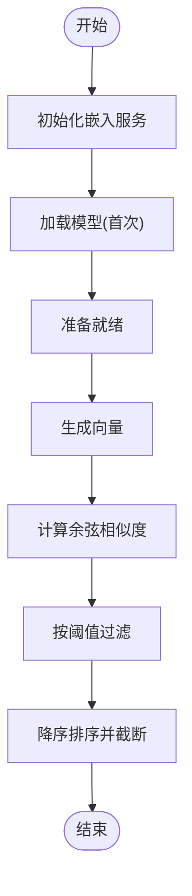
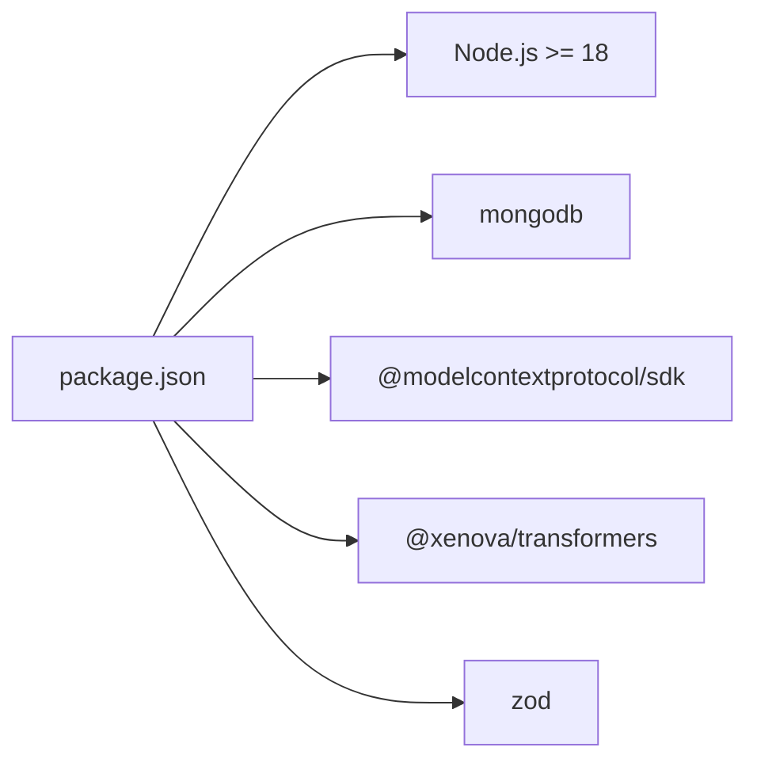

# 生产环境部署

<cite>
**本文引用的文件**
- [package.json](file://package.json)
- [src/index.ts](file://src/index.ts)
- [src/utils/config.ts](file://src/utils/config.ts)
- [src/services/knowledge-service.ts](file://src/services/knowledge-service.ts)
- [src/services/embedding-service.ts](file://src/services/embedding-service.ts)
- [src/tools/knowledge-tools.ts](file://src/tools/knowledge-tools.ts)
- [src/types.ts](file://src/types.ts)
- [examples/mcp-config.json](file://examples/mcp-config.json)
</cite>

## 目录
1. [简介](#简介)
2. [项目结构](#项目结构)
3. [核心组件](#核心组件)
4. [架构总览](#架构总览)
5. [详细组件分析](#详细组件分析)
6. [依赖关系分析](#依赖关系分析)
7. [性能考虑](#性能考虑)
8. [故障排查指南](#故障排查指南)
9. [结论](#结论)
10. [附录](#附录)

## 简介
本指南面向生产环境部署，围绕该代码库的 MCP 服务器进行系统性说明。该服务以标准输入输出（stdio）模式运行，作为外部 IDE 的 MCP 服务器，提供知识库管理能力，包括多种知识类型的增删改查、统计、批量导入导出、语义检索与嵌入生成功能。部署目标包括：
- 明确硬件与软件依赖、系统配置
- 详述环境变量、数据库连接与安全配置
- 提供 systemd 服务配置、进程管理与监控建议
- 负载均衡、高可用与故障转移思路
- 版本升级、回滚与变更管理流程
- 性能调优参数、资源限制与容量规划建议

## 项目结构
该项目采用 TypeScript 编写，主要模块如下：
- 入口与服务器：src/index.ts
- 配置解析：src/utils/config.ts
- 知识库服务：src/services/knowledge-service.ts
- 嵌入服务：src/services/embedding-service.ts
- 工具集合：src/tools/knowledge-tools.ts
- 类型定义：src/types.ts
- 示例配置：examples/mcp-config.json

图表来源
- [src/index.ts](file://src/index.ts#L1-L148)
- [src/utils/config.ts](file://src/utils/config.ts#L1-L147)
- [src/services/knowledge-service.ts](file://src/services/knowledge-service.ts#L1-L404)
- [src/services/embedding-service.ts](file://src/services/embedding-service.ts#L1-L148)
- [src/tools/knowledge-tools.ts](file://src/tools/knowledge-tools.ts#L1-L800)
- [src/types.ts](file://src/types.ts#L1-L269)
- [examples/mcp-config.json](file://examples/mcp-config.json#L1-L94)

章节来源
- [package.json](file://package.json#L1-L48)
- [src/index.ts](file://src/index.ts#L1-L148)

## 核心组件
- 配置系统：从环境变量加载数据库连接、用户/设备/IDE 来源、嵌入开关与日志级别；提供校验与日志工具。
- 知识库服务：封装 MongoDB 连接、索引、CRUD、统计、批量操作、语义检索与嵌入生成。
- 嵌入服务：基于 @xenova/transformers 的文本向量嵌入，支持懒加载与余弦相似度计算。
- 工具集合：提供 MCP 工具清单与处理器，覆盖通用 CRUD、快捷工具与 MCP/规则/命令/上下文/经验等管理。

章节来源
- [src/utils/config.ts](file://src/utils/config.ts#L76-L147)
- [src/services/knowledge-service.ts](file://src/services/knowledge-service.ts#L20-L404)
- [src/services/embedding-service.ts](file://src/services/embedding-service.ts#L11-L148)
- [src/tools/knowledge-tools.ts](file://src/tools/knowledge-tools.ts#L29-L800)
- [src/types.ts](file://src/types.ts#L6-L74)

## 架构总览
该服务以 MCP 服务器形式运行，通过标准输入输出与 IDE 通信。启动时加载配置、连接数据库、注册工具并建立传输通道。嵌入功能按需初始化，支持语义检索与向量生成。

图表来源
- [src/index.ts](file://src/index.ts#L87-L148)
- [src/utils/config.ts](file://src/utils/config.ts#L76-L91)
- [src/services/knowledge-service.ts](file://src/services/knowledge-service.ts#L44-L87)
- [src/services/embedding-service.ts](file://src/services/embedding-service.ts#L24-L65)

## 详细组件分析

### 配置与环境变量
- 配置来源优先级：MCP 客户端传入 env > 系统环境变量 > 默认值
- 关键配置项
  - MONGO_URI：MongoDB 连接串（默认本地）
  - MONGO_DATABASE：数据库名（默认 mongo_mcp）
  - MONGO_COLLECTION：集合名（默认 knowledge）
  - USER_ID：用户标识（默认 default）
  - DEVICE_ID：设备标识（默认由 IDE 来源与主机名组合）
  - IDE_SOURCE：IDE 来源（qoder/trae/cursor/windsurf/vscode/manual/other）
  - ENABLE_EMBEDDING：是否启用向量嵌入（默认 false）
  - LOG_LEVEL：日志级别（debug/info/warn/error，默认 info）

图表来源
- [src/utils/config.ts](file://src/utils/config.ts#L76-L91)
- [src/utils/config.ts](file://src/utils/config.ts#L96-L115)

章节来源
- [src/utils/config.ts](file://src/utils/config.ts#L76-L147)
- [examples/mcp-config.json](file://examples/mcp-config.json#L1-L94)

### 知识库服务与数据库设计
- 连接与索引
  - 连接：使用 MongoClient 按配置连接数据库与集合
  - 索引：确保用户级唯一索引、用户+类型、用户+设备、标签、时间排序等
- 文档模型
  - 支持 8 种知识类型：Memories、Skills、Rules、MCPs、Experiences、Commands、Contexts、Workflows
  - 用户隔离与跨终端同步：通过 userId/deviceId/ideSource 标识
  - 向量嵌入字段：embedding、embeddingModel、embeddedAt
- 核心操作
  - CRUD：create/get/update/delete
  - 列表与统计：list/count
  - 批量：bulkImport/bulkExport
  - 语义检索：semanticSearch（依赖嵌入服务）
  - 嵌入：generateEmbedding/generateEmbeddings/createWithEmbedding

图表来源
- [src/services/knowledge-service.ts](file://src/services/knowledge-service.ts#L20-L404)
- [src/services/embedding-service.ts](file://src/services/embedding-service.ts#L11-L148)

章节来源
- [src/services/knowledge-service.ts](file://src/services/knowledge-service.ts#L20-L404)
- [src/types.ts](file://src/types.ts#L24-L74)

### 工具集合与 MCP 接口
- 工具清单：包含通用 CRUD、统计、快捷工具（记忆/经验/命令/上下文/MCP 同步）等
- 输入参数：统一使用 JSON Schema 描述，要求字段明确
- 错误处理：捕获异常并返回结构化错误信息

图表来源
- [src/index.ts](file://src/index.ts#L29-L82)
- [src/tools/knowledge-tools.ts](file://src/tools/knowledge-tools.ts#L29-L800)

章节来源
- [src/tools/knowledge-tools.ts](file://src/tools/knowledge-tools.ts#L29-L800)

### 嵌入服务与语义检索
- 模型加载：首次使用时懒加载，支持量化与线程数控制
- 向量生成：对文本进行 mean pooling 与归一化
- 语义检索：计算余弦相似度，支持阈值与上限

图表来源
- [src/services/embedding-service.ts](file://src/services/embedding-service.ts#L24-L104)

章节来源
- [src/services/embedding-service.ts](file://src/services/embedding-service.ts#L11-L148)

## 依赖关系分析
- 运行时依赖
  - Node.js：>= 18.0.0
  - mongodb：MongoDB 官方驱动
  - @modelcontextprotocol/sdk：MCP 协议实现
  - @xenova/transformers：文本嵌入模型
  - zod：数据校验（在配置中使用）
- 开发依赖
  - TypeScript、ESLint、tsx 等

图表来源
- [package.json](file://package.json#L30-L46)

章节来源
- [package.json](file://package.json#L30-L46)

## 性能考虑
- 嵌入初始化
  - 首次加载模型耗时较长，建议在预热阶段完成初始化
  - 控制并发向量生成，避免同时触发多次模型加载
- 数据库性能
  - 确保集合具备必要索引（用户+类型、用户+设备、标签、时间排序）
  - 大批量导入/导出时分批处理，避免单次超大事务
- 查询优化
  - 语义检索开启前先生成嵌入，合理设置阈值与返回条数
  - 列表查询使用分页（limit/offset），避免一次性返回过多数据
- 资源限制
  - 为进程设置内存与 CPU 限制，结合容器编排平台的资源配额
  - 监控嵌入模型加载后的内存占用，避免峰值过高

## 故障排查指南
- 配置校验失败
  - 检查必填项：MONGO_URI、MONGO_DATABASE、MONGO_COLLECTION
  - 查看日志输出，确认环境变量是否被正确传递给 MCP 客户端
- 数据库连接问题
  - 确认连接串格式与可达性
  - 检查集合索引是否创建成功
- 嵌入服务初始化失败
  - 确认网络可达与磁盘空间
  - 减少并发初始化尝试
- 工具调用异常
  - 查看工具处理器返回的错误信息
  - 检查输入参数是否符合 JSON Schema

章节来源
- [src/utils/config.ts](file://src/utils/config.ts#L96-L115)
- [src/index.ts](file://src/index.ts#L93-L98)
- [src/services/knowledge-service.ts](file://src/services/knowledge-service.ts#L44-L54)

## 结论
本指南提供了从硬件与软件依赖、环境变量与数据库配置、安全与日志、进程管理与监控，到负载均衡与高可用、版本升级与回滚、性能调优与容量规划的完整生产部署参考。建议在正式上线前完成压测与演练，确保各组件协同稳定。

## 附录

### A. 硬件与软件要求
- 硬件
  - CPU：根据并发工具调用与嵌入计算需求评估
  - 内存：预留嵌入模型加载与运行内存，建议不低于 2GB，推荐 4GB+
  - 存储：MongoDB 数据与日志空间，建议 SSD
- 软件
  - 操作系统：Linux（推荐 Ubuntu/CentOS）或 Windows（WSL2）
  - 运行时：Node.js >= 18
  - 数据库：MongoDB（本地或托管集群，建议副本集/分片）

章节来源
- [package.json](file://package.json#L44-L46)

### B. 环境变量与配置
- 必填项
  - MONGO_URI：MongoDB 连接串
  - MONGO_DATABASE：数据库名
  - MONGO_COLLECTION：集合名
- 可选项
  - USER_ID、DEVICE_ID、IDE_SOURCE、ENABLE_EMBEDDING、LOG_LEVEL
- IDE 配置示例
  - Qoder/Cursor/VS Code 等 IDE 的 MCP 服务器配置示例

章节来源
- [src/utils/config.ts](file://src/utils/config.ts#L76-L91)
- [examples/mcp-config.json](file://examples/mcp-config.json#L1-L94)

### C. 数据库连接与索引
- 连接串格式：支持 mongodb:// 或 mongodb+srv://
- 集合索引：用户级唯一、用户+类型、用户+设备、标签、时间排序
- 建议
  - 使用只读账号用于查询，管理员账号用于维护
  - 启用副本集/分片，确保高可用与扩展性

章节来源
- [src/services/knowledge-service.ts](file://src/services/knowledge-service.ts#L44-L87)

### D. 安全配置
- 网络
  - MCP 以 stdio 模式运行，无需暴露网络端口
  - 如需 HTTP 管理面，请仅监听内网地址并启用 TLS
- 认证与授权
  - 通过 MCP 客户端侧的环境变量隔离不同用户/设备
  - 数据库侧使用认证与最小权限原则
- 日志
  - 生产环境建议使用 info 或更高日志级别
  - 避免在日志中输出敏感信息

章节来源
- [src/utils/config.ts](file://src/utils/config.ts#L120-L146)
- [src/index.ts](file://src/index.ts#L100-L102)

### E. systemd 服务配置与进程管理
- 目标
  - 将 MCP 服务器作为系统服务运行，支持开机自启、自动重启与日志聚合
- 建议步骤
  - 创建服务单元文件，设置 ExecStart 指向构建产物或 npx 命令
  - 在 EnvironmentFile 中注入数据库与日志相关环境变量
  - 设置 Restart=on-failure、RestartSec=10
  - 使用 journald 或集中式日志收集（如 rsyslog/Fluent Bit）
- 监控
  - 结合进程监控（如进程级指标）与日志告警
  - 嵌入模型加载耗时与内存峰值纳入监控

章节来源
- [src/index.ts](file://src/index.ts#L133-L140)

### F. 负载均衡、高可用与故障转移
- 高可用
  - 数据库：MongoDB 副本集或分片集群
  - 服务：多实例部署，通过反向代理或服务网格实现健康检查与流量分发
- 故障转移
  - 数据库：主节点故障自动切换
  - 服务：实例故障自动重启与替换
- 注意
  - 本服务为单进程 MCP 服务器，建议通过多实例与外部负载均衡实现高可用

章节来源
- [src/services/knowledge-service.ts](file://src/services/knowledge-service.ts#L44-L54)

### G. 版本升级、回滚与变更管理
- 升级流程
  - 构建新版本（npm run build），验证配置与工具清单
  - 滚动升级：逐台停止旧实例，启动新实例，健康检查通过后继续
- 回滚策略
  - 保留上一版本二进制，快速回退
  - 若涉及数据库结构变更，提前备份并制定迁移脚本
- 变更管理
  - 工具新增/删除需灰度发布
  - 配置变更通过环境变量与配置中心管理

章节来源
- [package.json](file://package.json#L10-L16)

### H. 性能调优参数与容量规划
- 嵌入性能
  - 控制并发向量生成数量，避免同时初始化多个模型
  - 使用量化模型与合适的池化/归一化参数
- 数据库性能
  - 确保索引命中率，定期分析慢查询
  - 分批导入/导出，控制单次写入规模
- 容量规划
  - 依据工具调用频率与文档数量估算 CPU/内存/IO
  - 预留 20%-30% 的资源冗余应对峰值