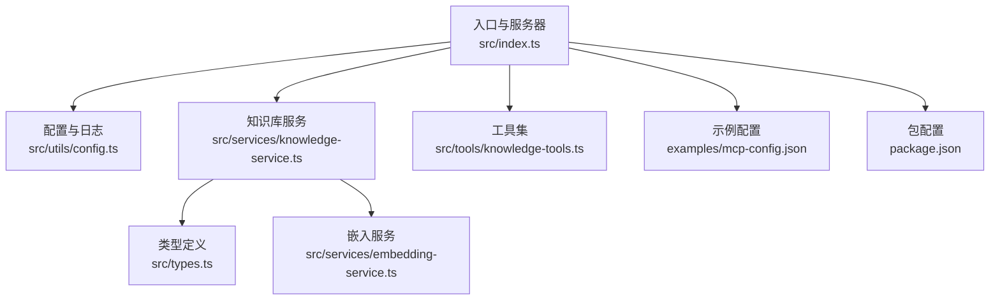
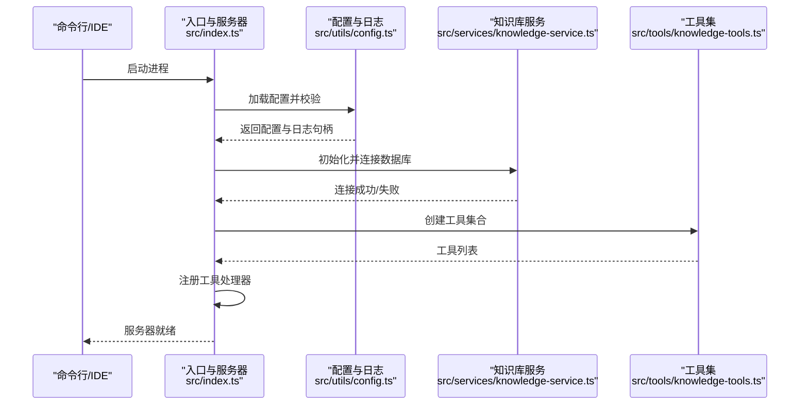
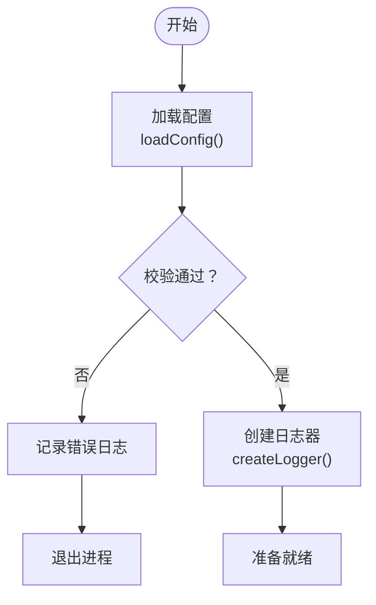
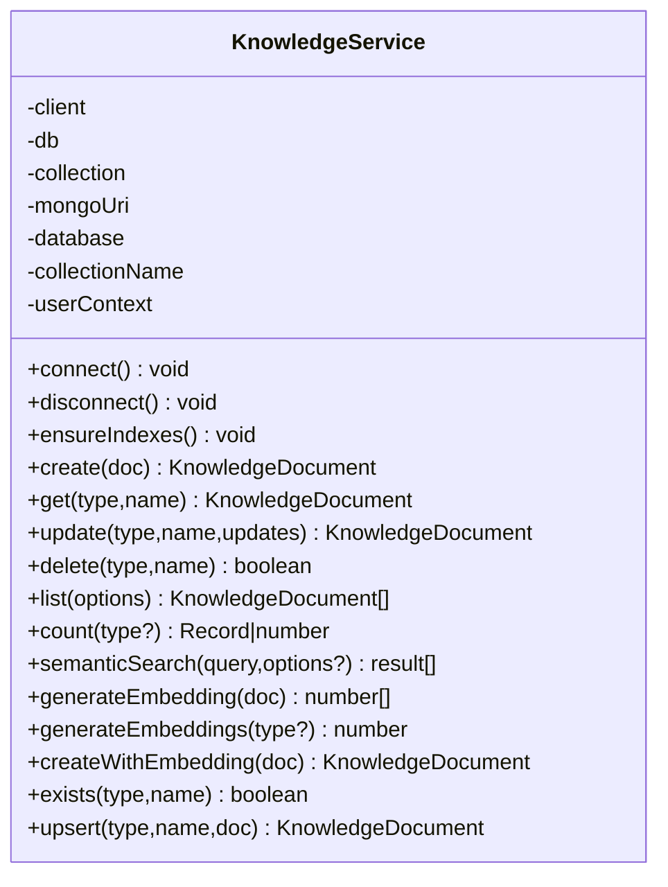
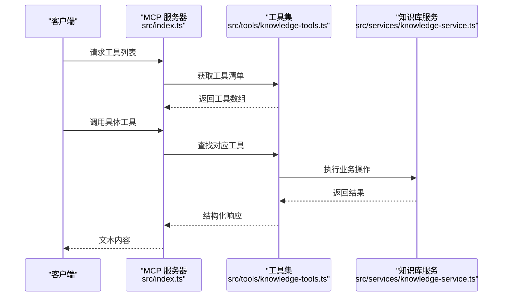
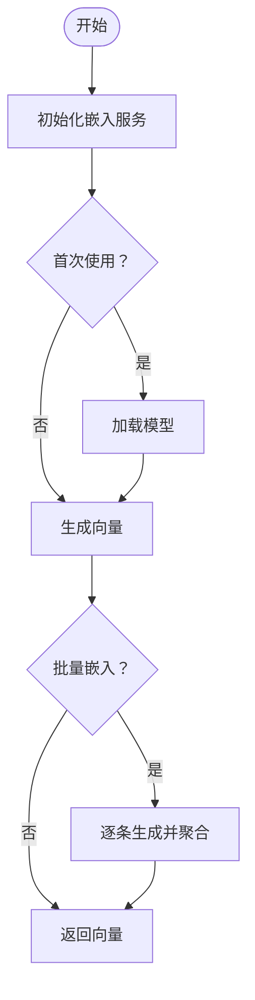
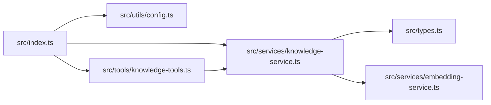

# 监控与日志

<cite>
**本文引用的文件**   
- [package.json](file://package.json)
- [examples/mcp-config.json](file://examples/mcp-config.json)
- [src/index.ts](file://src/index.ts)
- [src/utils/config.ts](file://src/utils/config.ts)
- [src/services/knowledge-service.ts](file://src/services/knowledge-service.ts)
- [src/tools/knowledge-tools.ts](file://src/tools/knowledge-tools.ts)
- [src/types.ts](file://src/types.ts)
- [src/services/embedding-service.ts](file://src/services/embedding-service.ts)
</cite>

## 目录
1. [简介](#简介)
2. [项目结构](#项目结构)
3. [核心组件](#核心组件)
4. [架构总览](#架构总览)
5. [详细组件分析](#详细组件分析)
6. [依赖关系分析](#依赖关系分析)
7. [性能考量](#性能考量)
8. [故障排查指南](#故障排查指南)
9. [结论](#结论)
10. [附录](#附录)

## 简介
本指南围绕系统监控与日志管理展开，结合当前代码库的实际实现，给出可操作的监控配置建议、日志结构与级别、日志轮转策略、告警规则与通知渠道、故障响应流程，以及 APM 集成、分布式追踪与性能分析方法，并提供监控仪表板与可视化展示思路。由于当前仓库未内置系统监控与日志采集组件，本指南以“基于现有能力进行扩展”的方式，帮助你在不侵入业务逻辑的前提下，安全地接入企业级监控体系。

## 项目结构
该仓库是一个基于 MCP 协议的 MongoDB 知识库服务，核心由以下模块构成：
- 入口与服务器：负责解析配置、初始化日志、连接数据库、注册工具并启动服务
- 配置与日志：从环境变量加载配置，按日志级别输出控制台日志
- 知识库服务：封装 MongoDB 连接、索引、CRUD、统计、批量导入导出、语义搜索与嵌入
- 工具集：暴露 MCP 工具接口，统一处理请求与错误
- 类型定义：定义知识库文档结构与查询选项
- 嵌入服务：基于 Transformers.js 的文本向量生成与相似度计算

**图表来源**
- [src/index.ts](file://src/index.ts#L1-L148)
- [src/utils/config.ts](file://src/utils/config.ts#L1-L147)
- [src/services/knowledge-service.ts](file://src/services/knowledge-service.ts#L1-L404)
- [src/tools/knowledge-tools.ts](file://src/tools/knowledge-tools.ts#L1-L800)
- [src/types.ts](file://src/types.ts#L1-L269)
- [src/services/embedding-service.ts](file://src/services/embedding-service.ts#L1-L148)
- [examples/mcp-config.json](file://examples/mcp-config.json#L1-L94)
- [package.json](file://package.json#L1-L48)

**章节来源**
- [src/index.ts](file://src/index.ts#L1-L148)
- [src/utils/config.ts](file://src/utils/config.ts#L1-L147)
- [src/services/knowledge-service.ts](file://src/services/knowledge-service.ts#L1-L404)
- [src/tools/knowledge-tools.ts](file://src/tools/knowledge-tools.ts#L1-L800)
- [src/types.ts](file://src/types.ts#L1-L269)
- [src/services/embedding-service.ts](file://src/services/embedding-service.ts#L1-L148)
- [examples/mcp-config.json](file://examples/mcp-config.json#L1-L94)
- [package.json](file://package.json#L1-L48)

## 核心组件
- 入口与服务器：创建 MCP 服务器，注册工具列表与调用处理器，连接 MongoDB 并监听进程信号优雅退出
- 配置与日志：从环境变量加载配置，校验必填项，按日志级别输出到标准错误流
- 知识库服务：封装数据库连接、索引、CRUD、统计、批量导入导出、语义搜索与嵌入
- 工具集：提供通用 CRUD、统计、上下文/命令/MCP/经验/记忆等快捷工具
- 嵌入服务：提供文本向量生成、余弦相似度计算与批量嵌入

**章节来源**
- [src/index.ts](file://src/index.ts#L16-L82)
- [src/utils/config.ts](file://src/utils/config.ts#L76-L146)
- [src/services/knowledge-service.ts](file://src/services/knowledge-service.ts#L44-L87)
- [src/tools/knowledge-tools.ts](file://src/tools/knowledge-tools.ts#L29-L399)
- [src/services/embedding-service.ts](file://src/services/embedding-service.ts#L11-L147)

## 架构总览
下图展示了 MCP 服务器启动、配置加载、日志初始化、数据库连接与工具注册的整体流程。

**图表来源**
- [src/index.ts](file://src/index.ts#L87-L144)
- [src/utils/config.ts](file://src/utils/config.ts#L76-L146)
- [src/services/knowledge-service.ts](file://src/services/knowledge-service.ts#L44-L54)
- [src/tools/knowledge-tools.ts](file://src/tools/knowledge-tools.ts#L29-L32)

**章节来源**
- [src/index.ts](file://src/index.ts#L87-L144)
- [src/utils/config.ts](file://src/utils/config.ts#L76-L146)
- [src/services/knowledge-service.ts](file://src/services/knowledge-service.ts#L44-L54)
- [src/tools/knowledge-tools.ts](file://src/tools/knowledge-tools.ts#L29-L32)

## 详细组件分析

### 组件A：配置与日志
- 配置来源与优先级：MCP 客户端传入环境变量 > 系统环境变量 > 默认值
- 校验规则：要求提供数据库连接串、数据库名、集合名
- 日志级别：debug/info/warn/error，按级别输出到标准错误流
- 示例配置：IDE 集成示例中包含 LOG_LEVEL 环境变量设置

**图表来源**
- [src/utils/config.ts](file://src/utils/config.ts#L76-L115)
- [src/utils/config.ts](file://src/utils/config.ts#L120-L146)
- [src/index.ts](file://src/index.ts#L88-L98)

**章节来源**
- [src/utils/config.ts](file://src/utils/config.ts#L76-L146)
- [examples/mcp-config.json](file://examples/mcp-config.json#L11-L18)
- [src/index.ts](file://src/index.ts#L88-L98)

### 组件B：知识库服务（数据库访问层）
- 连接与断开：建立 MongoDB 连接，确保索引存在
- 查询与写入：提供 CRUD、列表、统计、批量导入导出
- 语义搜索：可选嵌入生成与相似度匹配
- 性能要点：已创建用户级唯一索引、类型/标签/时间索引；建议在高并发场景下评估连接池与分页参数

**图表来源**
- [src/services/knowledge-service.ts](file://src/services/knowledge-service.ts#L20-L403)

**章节来源**
- [src/services/knowledge-service.ts](file://src/services/knowledge-service.ts#L44-L87)
- [src/services/knowledge-service.ts](file://src/services/knowledge-service.ts#L111-L190)
- [src/services/knowledge-service.ts](file://src/services/knowledge-service.ts#L195-L267)
- [src/services/knowledge-service.ts](file://src/services/knowledge-service.ts#L272-L341)

### 组件C：工具集（MCP 工具）
- 工具注册：统一注册工具列表与调用处理器
- 错误处理：捕获工具执行异常并返回结构化错误
- 快捷工具：记忆、经验、命令、上下文、MCP 同步等

**图表来源**
- [src/index.ts](file://src/index.ts#L29-L79)
- [src/tools/knowledge-tools.ts](file://src/tools/knowledge-tools.ts#L36-L106)
- [src/services/knowledge-service.ts](file://src/services/knowledge-service.ts#L111-L190)

**章节来源**
- [src/index.ts](file://src/index.ts#L29-L79)
- [src/tools/knowledge-tools.ts](file://src/tools/knowledge-tools.ts#L36-L106)
- [src/services/knowledge-service.ts](file://src/services/knowledge-service.ts#L111-L190)

### 组件D：嵌入服务（向量检索）
- 模型懒加载：首次使用时加载特征提取模型
- 向量生成：支持单条与批量嵌入
- 相似度计算：余弦相似度
- 文本抽取：从文档字段拼接用于嵌入的文本

**图表来源**
- [src/services/embedding-service.ts](file://src/services/embedding-service.ts#L24-L80)

**章节来源**
- [src/services/embedding-service.ts](file://src/services/embedding-service.ts#L24-L80)
- [src/services/knowledge-service.ts](file://src/services/knowledge-service.ts#L272-L299)

## 依赖关系分析
- 入口依赖配置与日志、知识库服务与工具集
- 知识库服务依赖 MongoDB 驱动与嵌入服务
- 工具集依赖知识库服务
- 嵌入服务依赖 Transformers.js

**图表来源**
- [src/index.ts](file://src/index.ts#L1-L12)
- [src/services/knowledge-service.ts](file://src/services/knowledge-service.ts#L1-L4)
- [src/tools/knowledge-tools.ts](file://src/tools/knowledge-tools.ts#L1-L2)
- [src/services/embedding-service.ts](file://src/services/embedding-service.ts#L1-L1)

**章节来源**
- [src/index.ts](file://src/index.ts#L1-L12)
- [src/services/knowledge-service.ts](file://src/services/knowledge-service.ts#L1-L4)
- [src/tools/knowledge-tools.ts](file://src/tools/knowledge-tools.ts#L1-L2)
- [src/services/embedding-service.ts](file://src/services/embedding-service.ts#L1-L1)

## 性能考量
- 数据库层面
  - 已创建用户级唯一索引与常用查询索引，建议在高并发场景下评估连接池大小与分页参数
  - 语义搜索涉及向量计算与相似度比较，建议对查询词与阈值进行调优，并考虑缓存热点结果
- 嵌入服务
  - 模型懒加载仅在首次使用时发生，后续调用性能稳定；批量嵌入时注意内存占用与队列长度
- 日志
  - 当前日志输出到标准错误流，建议在生产环境接入结构化日志收集（如 Fluent Bit、Vector），并按级别分流

[本节为通用指导，无需特定文件引用]

## 故障排查指南
- 配置校验失败
  - 现象：启动时报错并退出
  - 排查：确认 MONGO_URI、MONGO_DATABASE、MONGO_COLLECTION 是否正确设置
  - 参考：配置加载与校验逻辑
- 数据库连接失败
  - 现象：连接 MongoDB 失败
  - 排查：检查连接串、认证信息、网络连通性与防火墙策略
- 工具调用异常
  - 现象：工具返回错误消息
  - 排查：查看工具处理器中的异常捕获与返回结构
- 嵌入服务初始化缓慢
  - 现象：首次向量生成耗时较长
  - 排查：确认模型下载与缓存路径权限，必要时预热服务

**章节来源**
- [src/index.ts](file://src/index.ts#L94-L98)
- [src/index.ts](file://src/index.ts#L141-L144)
- [src/utils/config.ts](file://src/utils/config.ts#L96-L115)
- [src/services/knowledge-service.ts](file://src/services/knowledge-service.ts#L44-L54)
- [src/tools/knowledge-tools.ts](file://src/tools/knowledge-tools.ts#L99-L105)
- [src/services/embedding-service.ts](file://src/services/embedding-service.ts#L42-L51)

## 结论
本指南基于现有代码库，梳理了配置、日志、数据库访问与工具集的关键点，并针对性能与故障提供了可落地的建议。对于系统监控与日志管理，建议在不改变现有实现的前提下，通过外部工具链完成指标采集、日志聚合与告警通知，从而获得更全面的可观测性。

[本节为总结，无需特定文件引用]

## 附录

### A. 关键性能指标（KPI）监控配置建议
- CPU
  - 采集：系统指标（利用率、负载）、容器/进程指标（可选）
  - 建议：阈值 80% 警告，90% 告警；结合进程重启策略
- 内存
  - 采集：RSS、堆内存（如 Node.js）、GC 次数与停顿
  - 建议：阈值 85% 警告，95% 告警；关注内存泄漏趋势
- 磁盘
  - 采集：容量、IOPS、延迟、队列深度
  - 建议：容量 80% 警告，90% 告警；I/O 延迟异常需联动排查
- 网络
  - 采集：吞吐、连接数、错误率、重传
  - 建议：错误率>0.1% 告警；带宽利用率>80% 需扩容

[本节为通用指导，无需特定文件引用]

### B. 数据库性能监控、查询优化与慢查询分析
- 指标
  - 连接数、命令耗时、锁等待、未命中率、索引使用率
- 优化
  - 基于现有索引（用户+类型/标签/时间）进行查询优化
  - 对高频查询增加复合索引；避免全表扫描
- 慢查询
  - 建议开启慢查询日志与采样，定位高耗时聚合与排序
  - 结合业务场景调整分页与投影字段

**章节来源**
- [src/services/knowledge-service.ts](file://src/services/knowledge-service.ts#L74-L86)
- [src/services/knowledge-service.ts](file://src/services/knowledge-service.ts#L195-L216)

### C. 应用日志结构、日志级别与轮转策略
- 结构
  - 建议统一结构化字段：timestamp、level、service、instance、trace_id/span_id、module、action、duration_ms、status、error
- 级别
  - debug：调试细节
  - info：常规运行信息
  - warn：潜在问题
  - error：错误事件
- 轮转
  - 基于大小与时间轮转，保留7-30天；压缩归档

**章节来源**
- [src/utils/config.ts](file://src/utils/config.ts#L120-L146)
- [examples/mcp-config.json](file://examples/mcp-config.json#L11-L18)

### D. 告警规则配置、通知渠道与故障响应流程
- 规则
  - CPU/内存/磁盘/网络阈值告警；数据库连接失败、慢查询超限、工具调用错误率
- 通知
  - 邮件、IM（如钉钉/飞书）、电话（严重级别）
- 流程
  - 发现 -> 评估 -> 分级 -> 处置 -> 回归验证 -> 复盘

[本节为通用指导，无需特定文件引用]

### E. APM 工具集成、分布式追踪与性能分析
- APM
  - 推荐：OpenTelemetry、DataDog、NewRelic、Sentry
- 分布式追踪
  - 为 MCP 请求与数据库调用打点，生成 trace_id/span_id
- 性能分析
  - 结合火焰图、P95/P99 延迟、错误分布与资源使用

[本节为通用指导，无需特定文件引用]

### F. 监控仪表板配置、可视化与报告
- 仪表板
  - 实时面板：KPI、错误率、吞吐、延迟
  - 专项面板：数据库、嵌入服务、工具调用成功率
- 报告
  - 日报/周报：趋势、异常事件、容量预测

[本节为通用指导，无需特定文件引用]