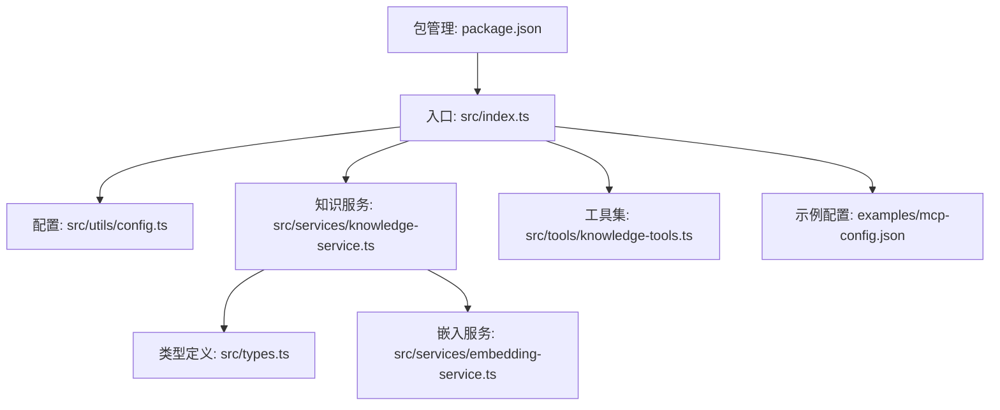
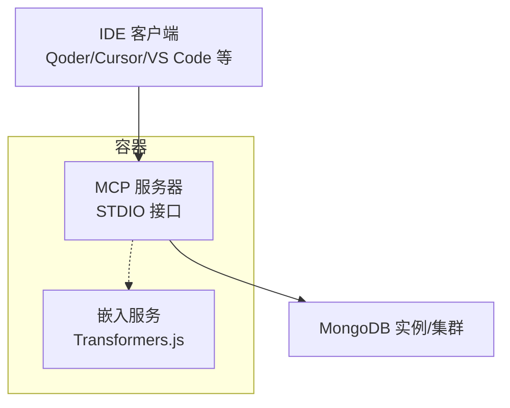
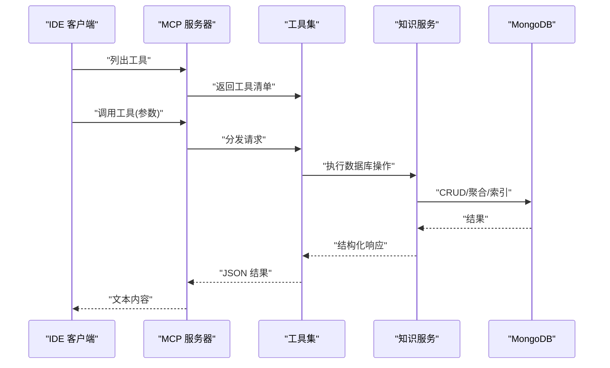
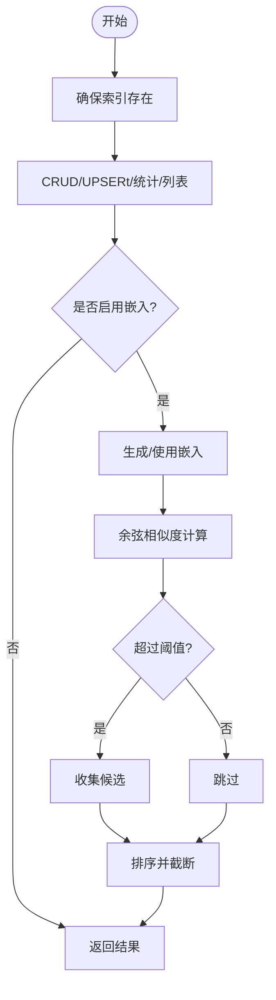
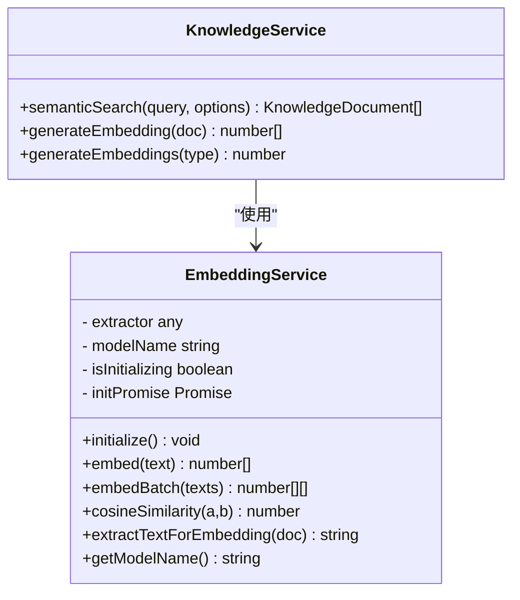
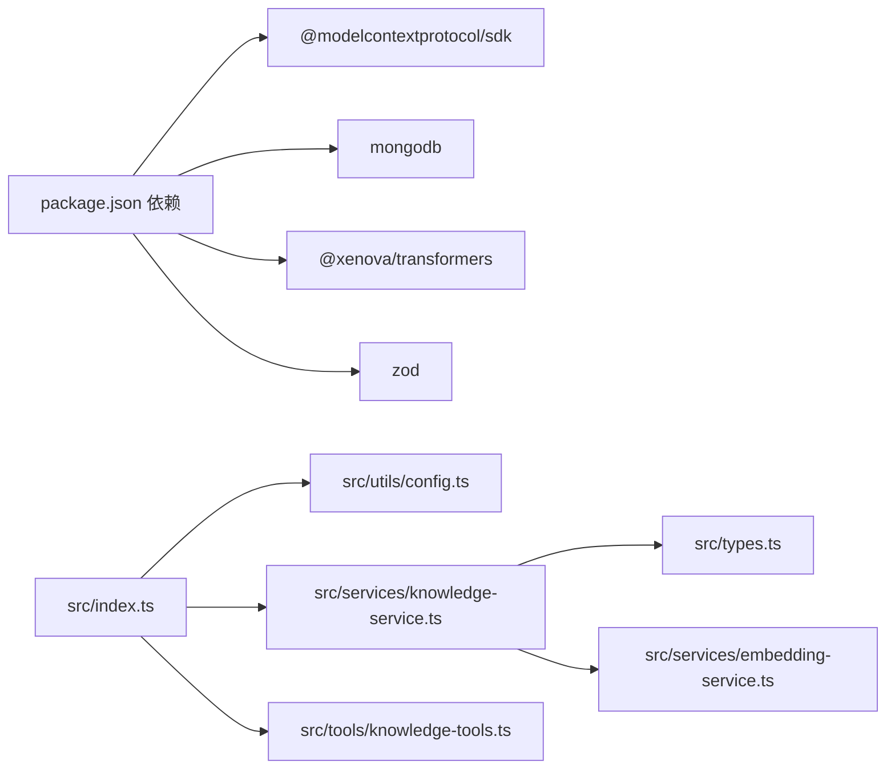

# 部署运维

<cite>
**本文引用的文件**
- [package.json](file://package.json)
- [src/index.ts](file://src/index.ts)
- [src/utils/config.ts](file://src/utils/config.ts)
- [src/services/knowledge-service.ts](file://src/services/knowledge-service.ts)
- [src/tools/knowledge-tools.ts](file://src/tools/knowledge-tools.ts)
- [src/types.ts](file://src/types.ts)
- [src/services/embedding-service.ts](file://src/services/embedding-service.ts)
- [examples/mcp-config.json](file://examples/mcp-config.json)
</cite>

## 目录
1. [简介](#简介)
2. [项目结构](#项目结构)
3. [核心组件](#核心组件)
4. [架构总览](#架构总览)
5. [详细组件分析](#详细组件分析)
6. [依赖关系分析](#依赖关系分析)
7. [性能考虑](#性能考虑)
8. [故障排查指南](#故障排查指南)
9. [结论](#结论)
10. [附录](#附录)

## 简介
本指南面向生产环境部署与运维，围绕基于 MongoDB 的 MCP 服务器进行全栈部署与运行时管理。内容覆盖：
- 生产部署步骤与配置要点
- Docker 容器化与 Kubernetes 部署建议
- 云平台部署与托管方案
- 监控指标、日志与告警
- 数据库备份、恢复与灾备
- 性能监控、容量规划与扩容策略
- 安全配置、访问控制与数据保护
- 运维自动化、CI/CD 与变更管理

## 项目结构
该项目采用 TypeScript 编写，核心入口负责启动 MCP 服务器并通过 STDIO 与客户端通信；配置与日志由工具模块提供；知识库服务封装 MongoDB 访问与索引；嵌入服务提供向量检索能力；工具集暴露 MCP 工具接口。

图表来源
- [src/index.ts](file://src/index.ts#L1-L148)
- [src/utils/config.ts](file://src/utils/config.ts#L1-L147)
- [src/services/knowledge-service.ts](file://src/services/knowledge-service.ts#L1-L404)
- [src/tools/knowledge-tools.ts](file://src/tools/knowledge-tools.ts#L1-L800)
- [src/types.ts](file://src/types.ts#L1-L269)
- [src/services/embedding-service.ts](file://src/services/embedding-service.ts#L1-L148)
- [examples/mcp-config.json](file://examples/mcp-config.json#L1-L94)
- [package.json](file://package.json#L1-L48)

章节来源
- [src/index.ts](file://src/index.ts#L1-L148)
- [package.json](file://package.json#L1-L48)

## 核心组件
- 入口与服务器
  - 通过 STDIO 与 MCP 客户端交互，注册工具列表与调用处理器。
  - 启动时加载配置、校验并连接 MongoDB，随后暴露工具集。
- 配置与日志
  - 从环境变量加载配置，支持 IDE 来源、日志级别、嵌入开关等。
  - 提供按级别输出的日志工具。
- 知识服务
  - 封装 MongoDB 连接、索引、CRUD、批量导入导出、统计、语义搜索与嵌入生成。
  - 支持用户隔离与跨设备同步。
- 嵌入服务
  - 基于 Transformers.js 的特征提取，支持余弦相似度计算与批量嵌入。
- 工具集
  - 提供通用 CRUD、统计、upsert、快捷工具（记忆、经验、命令、上下文、MCP 同步等）。
- 类型定义
  - 定义八种知识类型、文档结构、查询选项与工具输入模式。

章节来源
- [src/index.ts](file://src/index.ts#L16-L82)
- [src/utils/config.ts](file://src/utils/config.ts#L76-L91)
- [src/utils/config.ts](file://src/utils/config.ts#L96-L115)
- [src/utils/config.ts](file://src/utils/config.ts#L120-L146)
- [src/services/knowledge-service.ts](file://src/services/knowledge-service.ts#L20-L87)
- [src/services/knowledge-service.ts](file://src/services/knowledge-service.ts#L111-L127)
- [src/services/knowledge-service.ts](file://src/services/knowledge-service.ts#L272-L299)
- [src/services/embedding-service.ts](file://src/services/embedding-service.ts#L11-L51)
- [src/tools/knowledge-tools.ts](file://src/tools/knowledge-tools.ts#L29-L32)
- [src/types.ts](file://src/types.ts#L6-L14)

## 架构总览
下图展示 MCP 服务器在生产环境中的典型部署形态：容器内运行 Node 服务，连接外部 MongoDB 实例或托管集群，并通过 STDIO 与 IDE 客户端通信。

图表来源
- [src/index.ts](file://src/index.ts#L16-L82)
- [src/services/knowledge-service.ts](file://src/services/knowledge-service.ts#L44-L54)
- [src/services/embedding-service.ts](file://src/services/embedding-service.ts#L11-L51)

## 详细组件分析

### 组件 A：MCP 服务器与工具链
- 控制流
  - 入口加载配置并校验，连接 MongoDB，创建知识服务与工具集，建立 STDIO 传输并启动服务器。
  - 请求处理：列出工具与调用工具，工具内部委托知识服务完成数据库操作。
- 错误处理
  - 配置校验失败直接退出；工具调用异常返回结构化错误；进程监听 SIGINT/SIGTERM 优雅关闭。
- 关键路径
  - 服务器初始化与连接：[入口](file://src/index.ts#L87-L129)
  - 工具注册与调用：[工具集](file://src/tools/knowledge-tools.ts#L36-L107)

图表来源
- [src/index.ts](file://src/index.ts#L29-L79)
- [src/tools/knowledge-tools.ts](file://src/tools/knowledge-tools.ts#L72-L106)
- [src/services/knowledge-service.ts](file://src/services/knowledge-service.ts#L111-L127)

章节来源
- [src/index.ts](file://src/index.ts#L87-L145)
- [src/tools/knowledge-tools.ts](file://src/tools/knowledge-tools.ts#L36-L107)

### 组件 B：知识服务与索引设计
- 数据模型
  - 统一的知识文档结构，包含类型、用户/设备标识、同步版本、时间戳与可选嵌入字段。
- 索引策略
  - 用户+类型+名称唯一索引；用户+类型、用户+设备、用户+标签、用户+更新时间排序索引。
- 查询与统计
  - 支持按类型、标签、启用状态、关键词模糊匹配；支持分页与计数。
- 语义搜索
  - 基于嵌入相似度阈值与上限返回结果。
- 批量导入/导出
  - 支持批量写入与按类型导出。

图表来源
- [src/services/knowledge-service.ts](file://src/services/knowledge-service.ts#L71-L87)
- [src/services/knowledge-service.ts](file://src/services/knowledge-service.ts#L195-L216)
- [src/services/knowledge-service.ts](file://src/services/knowledge-service.ts#L272-L299)
- [src/services/embedding-service.ts](file://src/services/embedding-service.ts#L85-L104)

章节来源
- [src/services/knowledge-service.ts](file://src/services/knowledge-service.ts#L71-L87)
- [src/services/knowledge-service.ts](file://src/services/knowledge-service.ts#L195-L216)
- [src/services/knowledge-service.ts](file://src/services/knowledge-service.ts#L272-L299)
- [src/types.ts](file://src/types.ts#L24-L74)

### 组件 C：嵌入服务与模型加载
- 特征提取
  - 懒加载模型，批量嵌入与余弦相似度计算。
- 文本抽取
  - 从文档的名称、描述、内容与标签抽取文本，限制长度以平衡性能与精度。
- 单例模式
  - 全局唯一嵌入服务实例，避免重复初始化。

图表来源
- [src/services/embedding-service.ts](file://src/services/embedding-service.ts#L11-L147)
- [src/services/knowledge-service.ts](file://src/services/knowledge-service.ts#L272-L341)

章节来源
- [src/services/embedding-service.ts](file://src/services/embedding-service.ts#L11-L147)
- [src/services/knowledge-service.ts](file://src/services/knowledge-service.ts#L272-L341)

## 依赖关系分析
- 外部依赖
  - @modelcontextprotocol/sdk：MCP 协议实现与 STDIO 传输。
  - mongodb：官方驱动，提供连接、集合与索引管理。
  - @xenova/transformers：浏览器/Node 环境下的特征提取与 ONNX 运行时。
  - zod：类型验证（当前未在代码中直接使用，但可在配置校验扩展中引入）。
- 内部模块耦合
  - 入口依赖配置、知识服务与工具集；知识服务依赖类型与嵌入服务；工具集依赖知识服务。

图表来源
- [package.json](file://package.json#L30-L42)
- [src/index.ts](file://src/index.ts#L3-L11)
- [src/services/knowledge-service.ts](file://src/services/knowledge-service.ts#L1-L4)
- [src/tools/knowledge-tools.ts](file://src/tools/knowledge-tools.ts#L1-L2)
- [src/utils/config.ts](file://src/utils/config.ts#L1-L1)
- [src/services/embedding-service.ts](file://src/services/embedding-service.ts#L1-L1)

章节来源
- [package.json](file://package.json#L30-L42)
- [src/index.ts](file://src/index.ts#L3-L11)

## 性能考虑
- 连接与索引
  - 在连接时创建必要索引，确保高频查询（类型、标签、用户+时间）具备良好性能。
- 嵌入与相似度
  - 仅在启用嵌入时进行向量化与相似度计算；合理设置阈值与返回条数，避免大结果集扫描。
- 批量操作
  - 导入/导出与嵌入生成采用批量写入，减少往返次数。
- 模型加载
  - 懒加载嵌入模型，首次加载耗时集中在初始化阶段；生产中可通过预热策略降低首查询延迟。
- 日志级别
  - 生产环境建议使用 info 或更高级别，避免过多 debug 输出影响吞吐。

章节来源
- [src/services/knowledge-service.ts](file://src/services/knowledge-service.ts#L71-L87)
- [src/services/knowledge-service.ts](file://src/services/knowledge-service.ts#L272-L299)
- [src/services/embedding-service.ts](file://src/services/embedding-service.ts#L24-L51)
- [src/utils/config.ts](file://src/utils/config.ts#L120-L146)

## 故障排查指南
- 启动失败
  - 检查配置校验错误输出，确认数据库、集合与连接串有效。
  - 查看 MongoDB 连接日志与权限。
- 工具调用异常
  - 工具返回结构化错误，定位具体工具与参数；检查知识服务的 CRUD/UPsert 行为。
- 嵌入相关问题
  - 模型加载失败或内存不足：调整线程数与量化参数；确保磁盘缓存与网络访问正常。
- 优雅关闭
  - 监听 SIGINT/SIGTERM，确保断开数据库连接后再退出。

章节来源
- [src/index.ts](file://src/index.ts#L94-L98)
- [src/index.ts](file://src/index.ts#L141-L144)
- [src/index.ts](file://src/index.ts#L133-L140)
- [src/tools/knowledge-tools.ts](file://src/tools/knowledge-tools.ts#L99-L105)
- [src/services/embedding-service.ts](file://src/services/embedding-service.ts#L42-L51)

## 结论
本项目以 MCP 协议为核心，结合 MongoDB 实现跨 IDE 的知识库管理与工具调用。生产部署需重点关注配置管理、数据库连接与索引、嵌入模型加载与缓存、日志与监控以及安全与灾备。通过合理的容量规划与自动化运维，可实现稳定、可扩展的服务交付。

## 附录

### A. 生产部署步骤与配置要求
- 系统要求
  - Node.js 版本满足引擎要求。
  - MongoDB 连接串有效且具备读写权限。
- 配置项
  - 数据库连接串、数据库名、集合名、用户/设备/IDE 来源、嵌入开关、日志级别。
- 配置加载优先级
  - MCP 客户端传入环境变量 > 系统环境变量 > 默认值。
- 示例配置
  - 参考示例文件中各 IDE 的配置片段，按需调整环境变量。

章节来源
- [package.json](file://package.json#L44-L46)
- [src/utils/config.ts](file://src/utils/config.ts#L76-L91)
- [examples/mcp-config.json](file://examples/mcp-config.json#L1-L94)

### B. Docker 容器化部署方案
- 基础镜像
  - 使用官方 Node.js 镜像作为基础，安装运行时依赖。
- 构建与打包
  - 执行构建脚本生成 dist；将 dist 与依赖打包进镜像。
- 运行参数
  - 通过环境变量注入数据库连接串、日志级别等。
- 健康检查
  - 通过 STDIO 保持进程存活；可结合外部探针检测进程状态。
- 数据持久化
  - 如需缓存模型文件，挂载卷至模型缓存目录（注意路径与权限）。

章节来源
- [package.json](file://package.json#L10-L16)
- [src/index.ts](file://src/index.ts#L1-L148)

### C. Kubernetes 配置与云平台部署
- Deployment
  - 定义副本数、资源请求/限制；挂载密钥或配置映射以注入敏感配置。
- Service/Ingress
  - 通过 Ingress 暴露 MCP 服务；或在 IDE 侧以本地进程方式运行。
- ConfigMap/Secret
  - 将数据库连接串、日志级别等放入 Secret；工具配置放入 ConfigMap。
- Pod 策略
  - 设置重启策略、优雅终止宽限时间；为嵌入模型准备缓存卷。
- 云托管
  - MongoDB Atlas/云厂商托管实例；容器托管于 GKE/AKS/ECS 等。

章节来源
- [examples/mcp-config.json](file://examples/mcp-config.json#L1-L94)
- [src/utils/config.ts](file://src/utils/config.ts#L76-L91)

### D. 监控指标、日志与告警
- 指标
  - 启动耗时、工具调用耗时、嵌入模型加载耗时、数据库连接数、查询 QPS/错误率。
- 日志
  - 使用统一日志工具，按级别输出；生产环境建议 info。
- 告警
  - 连接失败、工具调用错误率、嵌入模型加载失败、数据库慢查询阈值。

章节来源
- [src/utils/config.ts](file://src/utils/config.ts#L120-L146)
- [src/services/embedding-service.ts](file://src/services/embedding-service.ts#L42-L51)

### E. 数据库备份、恢复与灾备
- 备份
  - 使用 MongoDB 自带工具定期导出集合；或使用托管服务的备份功能。
- 恢复
  - 在目标实例上导入备份；验证索引与数据完整性。
- 灾备
  - 异地副本与只读副本；切换策略与回切演练。

章节来源
- [src/services/knowledge-service.ts](file://src/services/knowledge-service.ts#L71-L87)

### F. 性能监控、容量规划与扩容策略
- 监控
  - 指标采集与可视化；慢查询与错误追踪。
- 容量规划
  - 评估文档规模、查询模式与嵌入存储；预留索引与缓存空间。
- 扩容
  - 垂直扩容提升单实例性能；水平扩容通过副本与分片策略扩展。

章节来源
- [src/services/knowledge-service.ts](file://src/services/knowledge-service.ts#L272-L299)

### G. 安全配置、访问控制与数据保护
- 访问控制
  - 限制数据库连接串与密钥；最小权限原则。
- 数据保护
  - 启用 TLS；对敏感字段加密；审计日志。
- 配置安全
  - 使用 Secret 管理敏感配置；避免明文存储。

章节来源
- [examples/mcp-config.json](file://examples/mcp-config.json#L1-L94)
- [src/utils/config.ts](file://src/utils/config.ts#L76-L91)

### H. 运维自动化、CI/CD 与变更管理
- CI/CD
  - 构建、测试、打包与发布流水线；镜像推送与编排文件部署。
- 变更管理
  - 配置变更审批与灰度发布；回滚策略与应急预案。

章节来源
- [package.json](file://package.json#L10-L16)