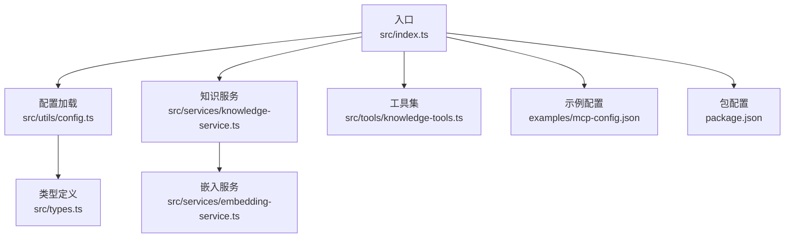
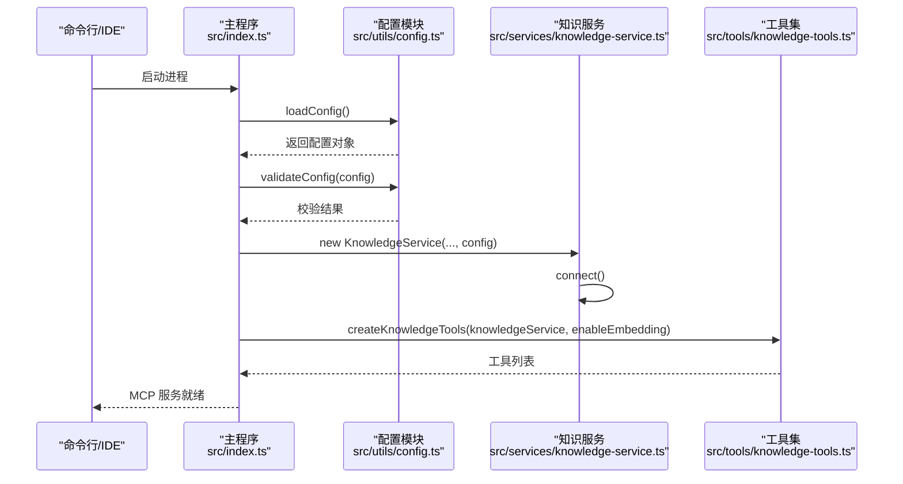
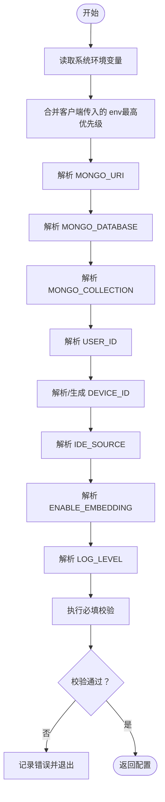
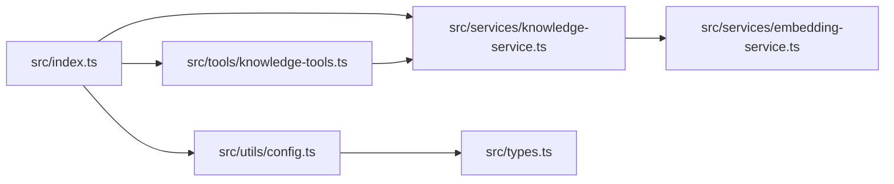

# 配置管理

<cite>
**本文引用的文件**
- [src/utils/config.ts](file://src/utils/config.ts)
- [src/index.ts](file://src/index.ts)
- [src/services/knowledge-service.ts](file://src/services/knowledge-service.ts)
- [src/tools/knowledge-tools.ts](file://src/tools/knowledge-tools.ts)
- [src/types.ts](file://src/types.ts)
- [src/services/embedding-service.ts](file://src/services/embedding-service.ts)
- [examples/mcp-config.json](file://examples/mcp-config.json)
- [package.json](file://package.json)
</cite>

## 目录
1. [简介](#简介)
2. [项目结构](#项目结构)
3. [核心组件](#核心组件)
4. [架构总览](#架构总览)
5. [详细组件分析](#详细组件分析)
6. [依赖分析](#依赖分析)
7. [性能考量](#性能考量)
8. [故障排查指南](#故障排查指南)
9. [结论](#结论)
10. [附录](#附录)

## 简介
本文件系统化梳理 mongo-mcp 的配置管理体系，覆盖配置文件层次、优先级与继承关系；逐项说明所有配置选项的含义、默认值与有效范围；给出环境变量配置的最佳实践与安全建议；阐述配置验证机制、错误处理与调试方法；对比生产与开发环境配置模板与差异；并提出配置热重载、动态更新与版本管理策略，以及配置迁移与向后兼容性建议。

## 项目结构
本项目采用按功能域分层的组织方式：
- 入口与控制流：src/index.ts
- 配置解析与校验：src/utils/config.ts
- 业务服务：src/services/knowledge-service.ts、src/services/embedding-service.ts
- 工具集：src/tools/knowledge-tools.ts
- 类型定义：src/types.ts
- 示例配置：examples/mcp-config.json
- 构建与运行：package.json

图表来源
- [src/index.ts](file://src/index.ts#L87-L147)
- [src/utils/config.ts](file://src/utils/config.ts#L76-L91)
- [src/services/knowledge-service.ts](file://src/services/knowledge-service.ts#L20-L40)
- [src/tools/knowledge-tools.ts](file://src/tools/knowledge-tools.ts#L29-L32)
- [src/services/embedding-service.ts](file://src/services/embedding-service.ts#L11-L19)
- [examples/mcp-config.json](file://examples/mcp-config.json#L1-L94)
- [package.json](file://package.json#L10-L16)

章节来源
- [src/index.ts](file://src/index.ts#L1-L148)
- [src/utils/config.ts](file://src/utils/config.ts#L1-L147)
- [src/services/knowledge-service.ts](file://src/services/knowledge-service.ts#L1-L404)
- [src/tools/knowledge-tools.ts](file://src/tools/knowledge-tools.ts#L1-L800)
- [src/types.ts](file://src/types.ts#L1-L269)
- [src/services/embedding-service.ts](file://src/services/embedding-service.ts#L1-L148)
- [examples/mcp-config.json](file://examples/mcp-config.json#L1-L94)
- [package.json](file://package.json#L1-L48)

## 核心组件
- 配置加载与校验：负责从环境变量解析配置、生成默认值、进行基础校验，并输出日志器。
- 知识服务：封装 MongoDB 连接、索引、CRUD、批量导入导出、语义检索与嵌入生成等能力。
- 工具集：暴露 MCP 工具接口，统一输入模式与错误处理。
- 嵌入服务：基于 Transformers.js 的文本向量化与相似度计算。
- 类型系统：统一定义知识文档类型、字段与查询选项。

章节来源
- [src/utils/config.ts](file://src/utils/config.ts#L76-L147)
- [src/services/knowledge-service.ts](file://src/services/knowledge-service.ts#L20-L404)
- [src/tools/knowledge-tools.ts](file://src/tools/knowledge-tools.ts#L1-L800)
- [src/services/embedding-service.ts](file://src/services/embedding-service.ts#L1-L148)
- [src/types.ts](file://src/types.ts#L1-L269)

## 架构总览
配置在应用启动阶段完成加载、校验与注入，随后驱动知识服务与工具集初始化，最终通过 MCP 协议对外提供工具调用能力。

图表来源
- [src/index.ts](file://src/index.ts#L87-L147)
- [src/utils/config.ts](file://src/utils/config.ts#L76-L115)
- [src/services/knowledge-service.ts](file://src/services/knowledge-service.ts#L44-L54)
- [src/tools/knowledge-tools.ts](file://src/tools/knowledge-tools.ts#L29-L32)

## 详细组件分析

### 配置系统设计与优先级
- 配置来源与优先级（从高到低）：
  1) MCP 客户端传入的 env（最高优先级）
  2) 系统环境变量
  3) 内置默认值（最低优先级）
- 关键配置项与默认值：
  - MONGO_URI：默认本地 MongoDB 地址
  - MONGO_DATABASE：默认数据库名
  - MONGO_COLLECTION：默认集合名
  - USER_ID：默认标识
  - DEVICE_ID：若未提供，依据 IDE 来源与主机名自动生成
  - IDE_SOURCE：枚举值限定，默认兜底为“other”
  - ENABLE_EMBEDDING：布尔开关，默认关闭
  - LOG_LEVEL：日志级别枚举，默认 info
- 验证规则：
  - 必填项：MONGO_URI、MONGO_DATABASE、MONGO_COLLECTION
  - 其他字段按类型与范围进行解析与兜底

图表来源
- [src/utils/config.ts](file://src/utils/config.ts#L76-L91)
- [src/utils/config.ts](file://src/utils/config.ts#L96-L115)
- [src/utils/config.ts](file://src/utils/config.ts#L33-L36)
- [src/utils/config.ts](file://src/utils/config.ts#L49-L55)
- [src/utils/config.ts](file://src/utils/config.ts#L60-L66)

章节来源
- [src/utils/config.ts](file://src/utils/config.ts#L76-L147)

### 配置选项详解与默认值
- MONGO_URI
  - 含义：MongoDB 连接字符串
  - 默认值：本地 MongoDB
  - 有效范围：合法的 MongoDB URI
  - 用途：建立数据库连接
- MONGO_DATABASE
  - 含义：数据库名称
  - 默认值：mongo_mcp
  - 有效范围：非空字符串
  - 用途：选择数据库
- MONGO_COLLECTION
  - 含义：集合名称
  - 默认值：knowledge
  - 有效范围：非空字符串
  - 用途：选择集合
- USER_ID
  - 含义：用户标识
  - 默认值：default
  - 有效范围：字符串
  - 用途：用户隔离与数据归属
- DEVICE_ID
  - 含义：设备标识
  - 默认值：由 IDE 来源与主机名拼接生成
  - 有效范围：字符串
  - 用途：跨设备同步与来源追踪
- IDE_SOURCE
  - 含义：IDE 来源类型
  - 默认值：other
  - 有效范围：枚举值之一
  - 用途：区分不同 IDE 的配置与行为
- ENABLE_EMBEDDING
  - 含义：是否启用向量嵌入
  - 默认值：false
  - 有效范围：布尔
  - 用途：控制语义检索与嵌入生成
- LOG_LEVEL
  - 含义：日志级别
  - 默认值：info
  - 有效范围：debug/info/warn/error
  - 用途：控制日志输出粒度

章节来源
- [src/utils/config.ts](file://src/utils/config.ts#L11-L28)
- [src/utils/config.ts](file://src/utils/config.ts#L33-L36)
- [src/utils/config.ts](file://src/utils/config.ts#L49-L66)
- [src/utils/config.ts](file://src/utils/config.ts#L76-L91)

### 环境变量配置最佳实践与安全考虑
- 最佳实践
  - 将敏感信息（如数据库凭据）置于受控的环境变量源，避免硬编码于配置文件或代码中
  - 为不同环境（开发、测试、生产）维护独立的环境变量集
  - 使用 IDE 或 MCP 客户端的 env 字段覆盖系统环境变量，确保客户端侧的差异化配置
  - 明确日志级别，生产环境建议使用 info 或更高，避免泄露敏感信息
- 安全考虑
  - 避免在日志中打印敏感字段
  - 对外暴露的配置模板不应包含真实密钥
  - 在 CI/CD 中使用密钥管理服务注入环境变量

章节来源
- [examples/mcp-config.json](file://examples/mcp-config.json#L11-L18)
- [examples/mcp-config.json](file://examples/mcp-config.json#L30-L36)
- [examples/mcp-config.json](file://examples/mcp-config.json#L47-L52)
- [examples/mcp-config.json](file://examples/mcp-config.json#L63-L71)
- [examples/mcp-config.json](file://examples/mcp-config.json#L82-L89)
- [src/utils/config.ts](file://src/utils/config.ts#L120-L146)

### 配置验证机制、错误处理与调试
- 验证机制
  - 必填字段校验：MONGO_URI、MONGO_DATABASE、MONGO_COLLECTION
  - 类型与范围校验：IDE_SOURCE、LOG_LEVEL、布尔解析
- 错误处理
  - 配置无效时，记录每条错误并退出进程
  - 工具调用异常捕获并返回结构化错误
- 调试方法
  - 通过 LOG_LEVEL 控制输出
  - 在启动阶段打印关键配置摘要
  - 使用嵌入服务的日志辅助定位向量化问题

章节来源
- [src/utils/config.ts](file://src/utils/config.ts#L96-L115)
- [src/index.ts](file://src/index.ts#L93-L98)
- [src/index.ts](file://src/index.ts#L141-L144)
- [src/tools/knowledge-tools.ts](file://src/tools/knowledge-tools.ts#L99-L105)
- [src/services/embedding-service.ts](file://src/services/embedding-service.ts#L42-L50)

### 生产环境配置模板与开发环境差异
- 开发环境示例
  - 使用本地构建或 npx 启动
  - 启用调试日志与嵌入（可选）
  - 示例字段：MONGO_URI、MONGO_DATABASE、USER_ID、DEVICE_ID、IDE_SOURCE、ENABLE_EMBEDDING、LOG_LEVEL
- 生产环境示例
  - 使用云数据库连接串
  - 团队共享知识库与设备标识
  - 示例字段：MONGO_URI、MONGO_DATABASE、USER_ID、DEVICE_ID、IDE_SOURCE、ENABLE_EMBEDDING
- 差异要点
  - 数据库地址与认证方式
  - 日志级别与性能敏感配置
  - 嵌入功能的启用与否

章节来源
- [examples/mcp-config.json](file://examples/mcp-config.json#L57-L74)
- [examples/mcp-config.json](file://examples/mcp-config.json#L76-L92)

### 配置热重载、动态更新与版本管理策略
- 现状与建议
  - 当前实现为一次性加载配置并启动，不支持运行时热重载
  - 推荐策略
    - 引入配置变更监听（如文件轮询或信号通知），在检测到变化时触发平滑重启
    - 对关键配置（如数据库连接）增加健康检查与回滚机制
    - 为配置引入版本号与变更记录，便于审计与回滚
  - 注意事项
    - 热重载需保证事务一致性与数据完整性
    - 对嵌入模型与索引等资源的重新初始化需谨慎处理

[本节为通用策略建议，不直接分析具体文件，故无章节来源]

### 配置迁移指南与向后兼容性
- 迁移指南
  - 新增配置项时，提供明确的默认值与解析逻辑
  - 对已弃用的环境变量提供映射与警告
  - 在升级过程中保留旧配置的兼容解析，逐步引导迁移
- 向后兼容性
  - 类型与枚举扩展应保持已有值不变
  - 配置解析函数应健壮，对未知值进行安全降级

[本节为通用策略建议，不直接分析具体文件，故无章节来源]

## 依赖分析
- 组件耦合
  - 入口依赖配置模块与知识服务
  - 知识服务依赖嵌入服务（按需）
  - 工具集依赖知识服务与配置中的嵌入开关
- 外部依赖
  - MongoDB 驱动：数据库连接与操作
  - Transformers.js：文本嵌入
  - MCP SDK：协议与传输

图表来源
- [src/index.ts](file://src/index.ts#L9-L11)
- [src/utils/config.ts](file://src/utils/config.ts#L1-L147)
- [src/services/knowledge-service.ts](file://src/services/knowledge-service.ts#L1-L404)
- [src/tools/knowledge-tools.ts](file://src/tools/knowledge-tools.ts#L1-L800)
- [src/services/embedding-service.ts](file://src/services/embedding-service.ts#L1-L148)
- [src/types.ts](file://src/types.ts#L1-L269)

章节来源
- [src/index.ts](file://src/index.ts#L1-L148)
- [src/utils/config.ts](file://src/utils/config.ts#L1-L147)
- [src/services/knowledge-service.ts](file://src/services/knowledge-service.ts#L1-L404)
- [src/tools/knowledge-tools.ts](file://src/tools/knowledge-tools.ts#L1-L800)
- [src/services/embedding-service.ts](file://src/services/embedding-service.ts#L1-L148)
- [src/types.ts](file://src/types.ts#L1-L269)

## 性能考量
- 嵌入性能
  - 模型懒加载与线程数限制，避免阻塞启动
  - 批量嵌入与相似度计算的内存占用
- 数据库性能
  - 合理的索引策略与查询过滤
  - 语义检索的阈值与返回数量限制
- 日志性能
  - 仅在必要级别输出详细日志

章节来源
- [src/services/embedding-service.ts](file://src/services/embedding-service.ts#L24-L51)
- [src/services/knowledge-service.ts](file://src/services/knowledge-service.ts#L71-L87)
- [src/utils/config.ts](file://src/utils/config.ts#L120-L146)

## 故障排查指南
- 启动失败
  - 检查配置校验错误输出
  - 确认数据库连接字符串与网络可达性
- 工具调用异常
  - 查看工具处理器的错误返回
  - 检查知识服务的 CRUD 与语义检索路径
- 嵌入相关问题
  - 关注模型加载耗时与初始化日志
  - 核对输入文本长度与内容格式

章节来源
- [src/index.ts](file://src/index.ts#L93-L98)
- [src/index.ts](file://src/index.ts#L141-L144)
- [src/tools/knowledge-tools.ts](file://src/tools/knowledge-tools.ts#L99-L105)
- [src/services/embedding-service.ts](file://src/services/embedding-service.ts#L42-L50)

## 结论
本配置管理系统以环境变量为核心，结合严格的解析与校验机制，确保在不同 IDE 与环境中的一致性与安全性。通过清晰的优先级与默认值策略，开发者可在开发与生产环境间灵活切换。未来可通过引入热重载、版本化配置与更完善的迁移策略，进一步提升系统的可运维性与稳定性。

## 附录
- 示例配置参考：examples/mcp-config.json
- 包脚本与引擎要求：package.json

章节来源
- [examples/mcp-config.json](file://examples/mcp-config.json#L1-L94)
- [package.json](file://package.json#L10-L16)