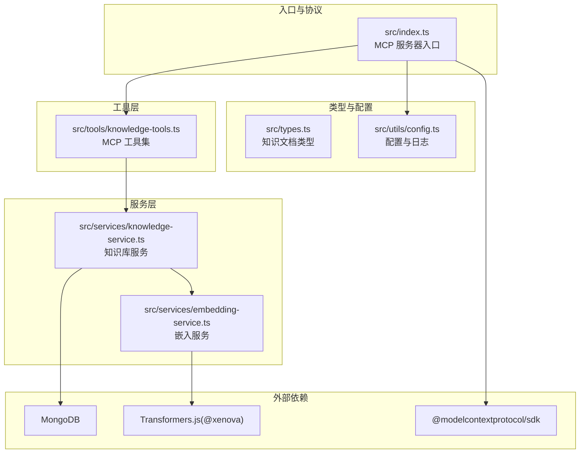
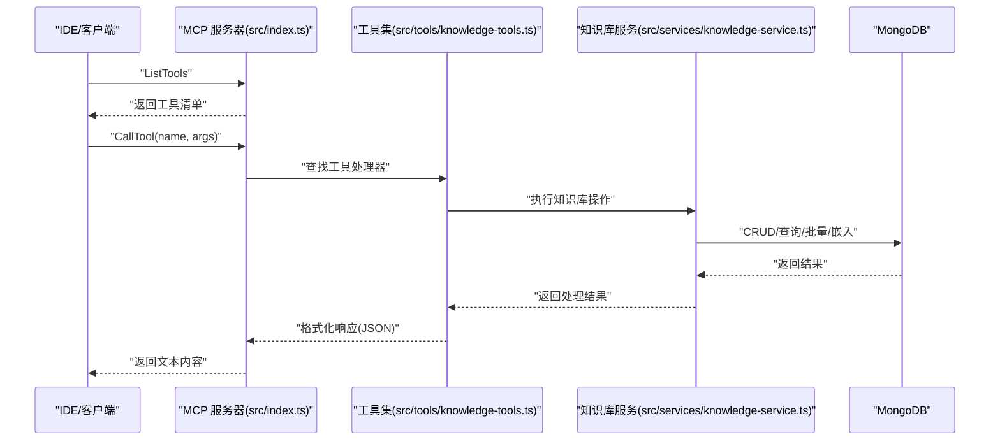
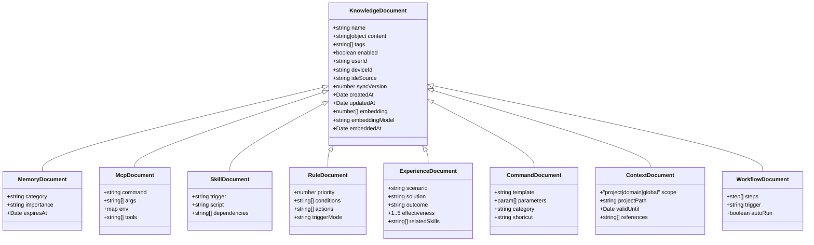
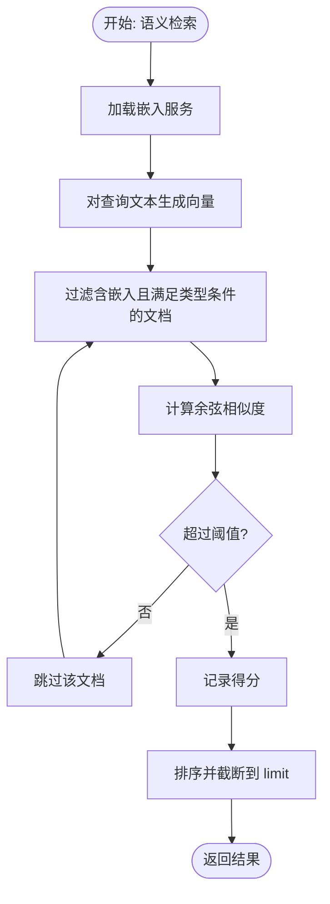
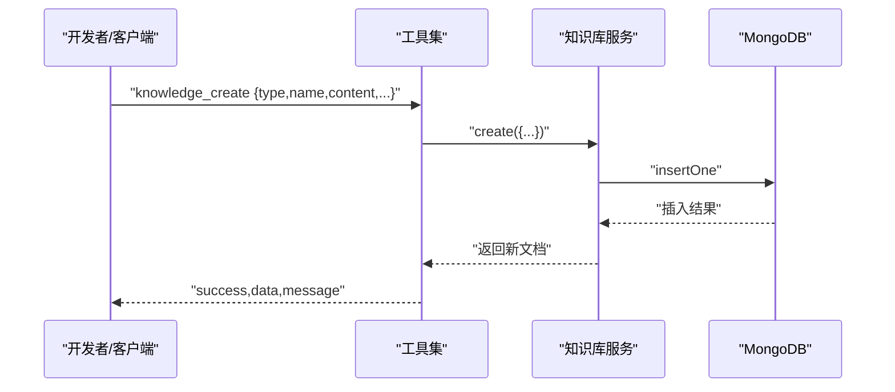
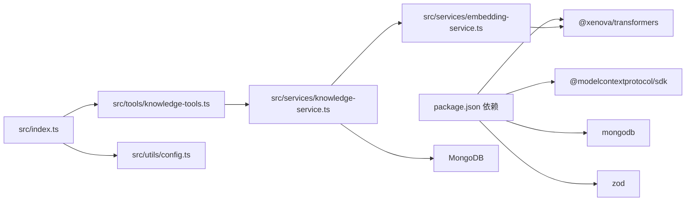

# 应用场景

<cite>
**本文引用的文件**
- [package.json](file://package.json)
- [src/index.ts](file://src/index.ts)
- [src/types.ts](file://src/types.ts)
- [src/utils/config.ts](file://src/utils/config.ts)
- [src/services/knowledge-service.ts](file://src/services/knowledge-service.ts)
- [src/services/embedding-service.ts](file://src/services/embedding-service.ts)
- [src/tools/knowledge-tools.ts](file://src/tools/knowledge-tools.ts)
- [examples/mcp-config.json](file://examples/mcp-config.json)
- [temp-skills/README.md](file://temp-skills/README.md)
- [temp-skills/spec/agent-skills-spec.md](file://temp-skills/spec/agent-skills-spec.md)
- [temp-skills/skills/algorithmic-art/SKILL.md](file://temp-skills/skills/algorithmic-art/SKILL.md)
- [temp-skills/skills/internal-comms/SKILL.md](file://temp-skills/skills/internal-comms/SKILL.md)
- [temp-skills/skills/mcp-builder/SKILL.md](file://temp-skills/skills/mcp-builder/SKILL.md)
</cite>

## 目录
1. [简介](#简介)
2. [项目结构](#项目结构)
3. [核心组件](#核心组件)
4. [架构总览](#架构总览)
5. [详细组件分析](#详细组件分析)
6. [依赖关系分析](#依赖关系分析)
7. [性能考量](#性能考量)
8. [故障排查指南](#故障排查指南)
9. [结论](#结论)
10. [附录](#附录)

## 简介
MongoDB MCP Server 是一个基于 Model Context Protocol（MCP）的跨 IDE 知识库管理工具，通过标准的 MCP 传输协议与各类 IDE/客户端交互，实现“记忆、技能、规则、MCP、经验、命令、上下文、工作流”八类知识资产的统一存储、检索与调用。其核心优势在于：
- 以 MongoDB 作为持久化后端，支持用户隔离与跨设备同步
- 可选的向量嵌入能力，提供语义检索与智能匹配
- 丰富的 MCP 工具集，覆盖 CRUD、快捷操作、上下文设置、MCP/规则同步等
- 面向开发者、企业团队与教育机构的多场景适配

## 项目结构
该项目采用分层与按职责划分的组织方式：
- 入口与协议层：MCP 服务器入口、stdio 传输、请求/响应处理
- 工具层：面向知识库的 MCP 工具集合，提供 CRUD、快捷操作、上下文与 MCP/规则同步
- 服务层：知识库服务封装 MongoDB 访问、索引、批量导入导出、语义检索与嵌入生成
- 嵌入服务层：基于 Transformers.js 的文本向量化与相似度计算
- 类型与配置：统一的知识文档类型定义、环境变量解析与校验、日志工具
- 示例与技能：IDE 配置示例、Agent Skills 规范与技能样例

图表来源
- [src/index.ts](file://src/index.ts#L1-L148)
- [src/tools/knowledge-tools.ts](file://src/tools/knowledge-tools.ts#L1-L120)
- [src/services/knowledge-service.ts](file://src/services/knowledge-service.ts#L1-L120)
- [src/services/embedding-service.ts](file://src/services/embedding-service.ts#L1-L80)
- [src/utils/config.ts](file://src/utils/config.ts#L1-L90)

章节来源
- [package.json](file://package.json#L1-L48)
- [src/index.ts](file://src/index.ts#L1-L148)
- [src/types.ts](file://src/types.ts#L1-L269)
- [src/utils/config.ts](file://src/utils/config.ts#L1-L147)
- [src/services/knowledge-service.ts](file://src/services/knowledge-service.ts#L1-L120)
- [src/services/embedding-service.ts](file://src/services/embedding-service.ts#L1-L80)
- [src/tools/knowledge-tools.ts](file://src/tools/knowledge-tools.ts#L1-L120)

## 核心组件
- MCP 服务器与传输
  - 通过 stdio 传输启动 MCP 服务器，注册工具清单与调用处理器
  - 支持列出工具与调用工具，返回 JSON 文本内容
- 知识库服务
  - 封装 MongoDB 连接、索引、CRUD、批量导入导出、统计、语义检索与嵌入生成
  - 用户上下文注入与跨设备同步版本号递增
- 嵌入服务
  - 延迟加载预训练模型，提供文本向量、余弦相似度与批量嵌入
- 工具集
  - 通用 CRUD 工具：knowledge_create/read/update/delete/list/stats/upsert
  - 快捷工具：memory_add/search、experience_add、command_add、context_set
  - 同步工具：mcp_sync、rule_sync
- 配置与日志
  - 环境变量解析与校验、日志级别控制、默认设备标识生成

章节来源
- [src/index.ts](file://src/index.ts#L16-L82)
- [src/services/knowledge-service.ts](file://src/services/knowledge-service.ts#L20-L120)
- [src/services/embedding-service.ts](file://src/services/embedding-service.ts#L11-L80)
- [src/tools/knowledge-tools.ts](file://src/tools/knowledge-tools.ts#L29-L120)
- [src/utils/config.ts](file://src/utils/config.ts#L76-L147)

## 架构总览
MCP 服务器启动后，根据配置连接 MongoDB 并初始化索引；随后创建知识库工具集并通过 MCP 协议暴露给客户端。当客户端请求工具调用时，服务器根据工具名路由到对应处理器，执行知识库操作并返回结果。

图表来源
- [src/index.ts](file://src/index.ts#L29-L79)
- [src/tools/knowledge-tools.ts](file://src/tools/knowledge-tools.ts#L36-L107)
- [src/services/knowledge-service.ts](file://src/services/knowledge-service.ts#L111-L190)

## 详细组件分析

### 知识库数据模型与类型体系
项目定义了八种知识类型，并为每种类型提供专用字段与约束，确保在不同场景下的一致性与扩展性。

图表来源
- [src/types.ts](file://src/types.ts#L24-L223)

章节来源
- [src/types.ts](file://src/types.ts#L1-L269)

### 知识库服务与语义检索
知识库服务负责：
- 连接 MongoDB、创建用户级索引（唯一 name/type、用户+类型、用户+设备、标签、时间排序）
- 提供 CRUD、upsert、批量导入导出、统计与列表查询
- 语义检索：生成查询向量，计算与已有文档的余弦相似度，按阈值与数量筛选

图表来源
- [src/services/knowledge-service.ts](file://src/services/knowledge-service.ts#L272-L299)
- [src/services/embedding-service.ts](file://src/services/embedding-service.ts#L56-L104)

章节来源
- [src/services/knowledge-service.ts](file://src/services/knowledge-service.ts#L71-L87)
- [src/services/knowledge-service.ts](file://src/services/knowledge-service.ts#L272-L341)
- [src/services/embedding-service.ts](file://src/services/embedding-service.ts#L41-L104)

### MCP 工具集与工作流
工具集覆盖通用 CRUD、快捷操作与同步工具，便于在 IDE 中直接调用知识库能力：
- 通用 CRUD：创建、读取、更新、删除、列表、统计、upsert
- 快捷工具：记忆、经验、命令、上下文的快速录入与检索
- 同步工具：将 MCP 配置与规则同步至知识库，便于跨设备共享

图表来源
- [src/tools/knowledge-tools.ts](file://src/tools/knowledge-tools.ts#L36-L107)
- [src/services/knowledge-service.ts](file://src/services/knowledge-service.ts#L111-L127)

章节来源
- [src/tools/knowledge-tools.ts](file://src/tools/knowledge-tools.ts#L29-L800)

### 配置与部署
- 环境变量优先级：MCP 客户端传入 env > 系统环境变量 > 默认值
- 支持 IDE 来源识别（qoder/trae/cursor/windsurf/vscode/manual/other）
- 日志级别可控，便于生产与调试
- 示例配置覆盖多种 IDE 的 MCP 服务器注册方式

章节来源
- [src/utils/config.ts](file://src/utils/config.ts#L76-L115)
- [examples/mcp-config.json](file://examples/mcp-config.json#L1-L94)

## 依赖关系分析
- 外部依赖
  - @modelcontextprotocol/sdk：MCP 协议与传输（stdio）
  - mongodb：MongoDB 官方驱动
  - @xenova/transformers：浏览器友好的 Transformers.js，用于本地文本嵌入
  - zod：输入校验（在工具层与配置层体现）
- 内部模块耦合
  - 入口依赖工具集与配置
  - 工具集依赖知识库服务
  - 知识库服务依赖嵌入服务与 MongoDB
  - 配置与日志贯穿各层

图表来源
- [package.json](file://package.json#L30-L42)
- [src/index.ts](file://src/index.ts#L3-L11)
- [src/tools/knowledge-tools.ts](file://src/tools/knowledge-tools.ts#L1-L3)
- [src/services/knowledge-service.ts](file://src/services/knowledge-service.ts#L1-L4)
- [src/services/embedding-service.ts](file://src/services/embedding-service.ts#L1-L1)

章节来源
- [package.json](file://package.json#L30-L42)
- [src/index.ts](file://src/index.ts#L3-L11)

## 性能考量
- 嵌入模型加载
  - 模型懒加载，首次使用时初始化，避免启动时阻塞
  - 建议在空闲时段批量生成嵌入，减少在线查询时的延迟
- 查询与索引
  - 用户级唯一索引与复合索引有助于提升 CRUD 与列表查询性能
  - 语义检索需遍历含嵌入的文档，建议限制类型与阈值，控制返回数量
- 批量操作
  - 批量导入/导出与批量嵌入生成适合离线任务，避免频繁在线写入
- 日志级别
  - 生产环境建议使用 info 或更高级别，降低 I/O 开销

章节来源
- [src/services/embedding-service.ts](file://src/services/embedding-service.ts#L24-L51)
- [src/services/knowledge-service.ts](file://src/services/knowledge-service.ts#L71-L87)
- [src/utils/config.ts](file://src/utils/config.ts#L120-L146)

## 故障排查指南
- 启动失败
  - 检查配置校验错误输出，确认数据库、集合与连接串有效
  - 查看日志级别与环境变量是否正确
- 工具调用异常
  - 确认工具名是否存在，查看处理器返回的错误信息
  - 对于嵌入相关操作，检查 ENABLE_EMBEDDING 是否开启以及网络可达性
- MongoDB 连接问题
  - 确认连接串、认证与网络连通性
  - 检查索引是否创建成功，避免重复插入导致的唯一键冲突

章节来源
- [src/index.ts](file://src/index.ts#L94-L98)
- [src/utils/config.ts](file://src/utils/config.ts#L96-L115)
- [src/tools/knowledge-tools.ts](file://src/tools/knowledge-tools.ts#L40-L55)

## 结论
MongoDB MCP Server 通过标准化的 MCP 协议与 MongoDB 的强一致性，为开发者、企业团队与教育机构提供了统一的知识资产管理与调用平台。其优势体现在：
- 跨 IDE/客户端的工具化访问
- 用户隔离与跨设备同步
- 可选语义检索增强知识发现
- 丰富的工具集覆盖常见使用模式

在选择是否采用时，建议评估以下因素：
- 是否需要在多个 IDE/客户端之间共享知识资产
- 是否需要语义检索与向量化能力
- 是否希望以 MCP 工具形式将知识能力集成到现有工作流

## 附录

### 场景化应用与最佳实践

- AI 辅助编程
  - 使用“记忆”记录用户偏好与对话历史；使用“上下文”注入项目背景；使用“命令”模板快速生成代码片段
  - 使用“经验”沉淀最佳实践；使用“工作流”编排多步骤任务
  - 建议开启嵌入以提升经验与上下文的语义召回
  - 章节来源
    - [src/types.ts](file://src/types.ts#L77-L88)
    - [src/types.ts](file://src/types.ts#L176-L190)
    - [src/types.ts](file://src/types.ts#L136-L152)
    - [src/types.ts](file://src/types.ts#L192-L210)

- 知识管理
  - 使用“技能”承载可执行脚本与工作流；使用“规则”约束行为与触发条件
  - 使用“MCPs”同步第三方工具配置，形成统一的外部服务接入层
  - 建议定期批量生成嵌入，提升检索质量
  - 章节来源
    - [src/types.ts](file://src/types.ts#L106-L118)
    - [src/types.ts](file://src/types.ts#L90-L104)
    - [src/tools/knowledge-tools.ts](file://src/tools/knowledge-tools.ts#L696-L758)

- 团队协作
  - 使用“内部沟通”技能模板快速生成公司内部通讯稿
  - 使用“上下文”共享项目背景与参考资料；使用“经验”沉淀团队最佳实践
  - 建议在共享数据库中维护统一的“命令”与“上下文”，提升协作效率
  - 章节来源
    - [temp-skills/skills/internal-comms/SKILL.md](file://temp-skills/skills/internal-comms/SKILL.md#L1-L33)

- 自动化工作流
  - 使用“工作流”定义多步骤流程；结合“规则”与“触发条件”实现自动化执行
  - 使用“MCP 同步”将外部工具纳入工作流
  - 建议将高频任务封装为“命令”与“经验”，降低重复劳动
  - 章节来源
    - [src/types.ts](file://src/types.ts#L192-L210)
    - [src/tools/knowledge-tools.ts](file://src/tools/knowledge-tools.ts#L760-L800)

- 教育与研究
  - 使用“算法艺术”技能模板进行创意生成与参数探索
  - 使用“Agent Skills 规范”指导技能设计与评估
  - 建议将教学案例与实验流程沉淀为“经验”与“工作流”
  - 章节来源
    - [temp-skills/skills/algorithmic-art/SKILL.md](file://temp-skills/skills/algorithmic-art/SKILL.md#L1-L120)
    - [temp-skills/spec/agent-skills-spec.md](file://temp-skills/spec/agent-skills-spec.md#L1-L4)

### 用户群体与使用方式

- 开发者
  - 在本地或私有云部署，使用 MCP 配置文件注册服务器
  - 通过“命令”与“上下文”提升日常开发效率
  - 通过“经验”沉淀个人最佳实践
  - 章节来源
    - [examples/mcp-config.json](file://examples/mcp-config.json#L57-L74)

- 企业团队
  - 使用共享数据库与统一的“命令/上下文/经验”库
  - 通过“规则”与“工作流”规范流程与权限
  - 通过“MCP 同步”整合第三方服务
  - 章节来源
    - [examples/mcp-config.json](file://examples/mcp-config.json#L76-L92)

- 教育机构
  - 使用“算法艺术”与“MCP 构建”技能开展教学与研究
  - 使用“Agent Skills 规范”指导课程设计与评估
  - 章节来源
    - [temp-skills/skills/algorithmic-art/SKILL.md](file://temp-skills/skills/algorithmic-art/SKILL.md#L1-L120)
    - [temp-skills/skills/mcp-builder/SKILL.md](file://temp-skills/skills/mcp-builder/SKILL.md#L1-L120)

### 实际使用案例与集成方案

- IDE 集成
  - 在 Qoder/Cursor/VS Code 中注册 MCP 服务器，设置环境变量与数据库连接
  - 使用示例配置文件作为起点，按需调整 USER_ID、DEVICE_ID、MONGO_URI 等
  - 章节来源
    - [examples/mcp-config.json](file://examples/mcp-config.json#L1-L94)

- MCP 服务器构建
  - 参考“MCP 构建”技能，设计工具命名、输入/输出模式与错误处理
  - 使用 Zod/Pydantic 进行输入校验，提供结构化输出
  - 章节来源
    - [temp-skills/skills/mcp-builder/SKILL.md](file://temp-skills/skills/mcp-builder/SKILL.md#L1-L237)

- 性能优化建议
  - 启用嵌入并定期批量生成，避免在线查询时的冷启动
  - 合理设置日志级别，生产环境使用 info 或更高
  - 使用索引与查询过滤，减少不必要的扫描
  - 章节来源
    - [src/services/knowledge-service.ts](file://src/services/knowledge-service.ts#L71-L87)
    - [src/utils/config.ts](file://src/utils/config.ts#L120-L146)

### 竞争优势与差异化特点
- 标准化协议与跨 IDE 兼容：基于 MCP 协议，适配多客户端
- 强一致存储：MongoDB 提供可靠的事务与索引能力
- 可选语义检索：Transformers.js 提供本地嵌入能力，兼顾隐私与性能
- 丰富工具集：覆盖 CRUD、快捷操作与同步工具，降低集成成本
- 用户隔离与跨设备同步：通过用户/设备/IDE 上下文实现安全共享

章节来源
- [package.json](file://package.json#L17-L27)
- [src/services/embedding-service.ts](file://src/services/embedding-service.ts#L1-L20)
- [src/tools/knowledge-tools.ts](file://src/tools/knowledge-tools.ts#L29-L120)