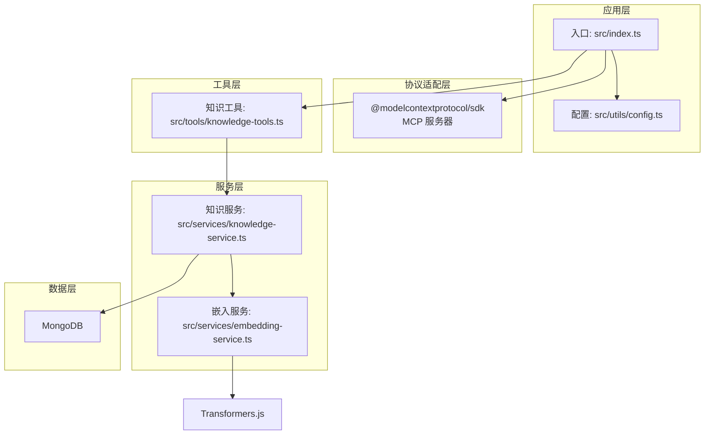
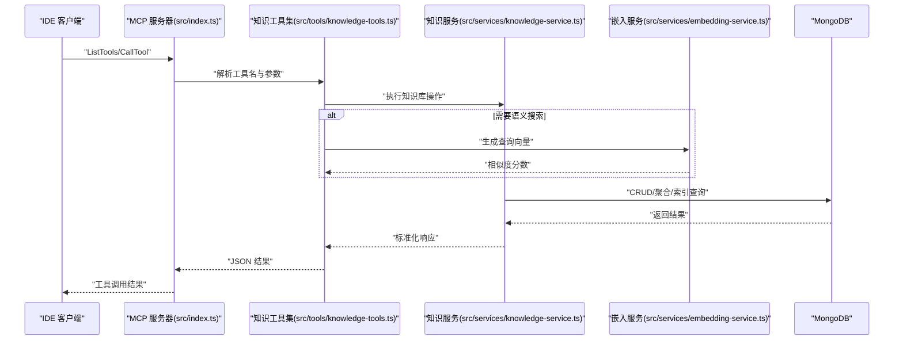
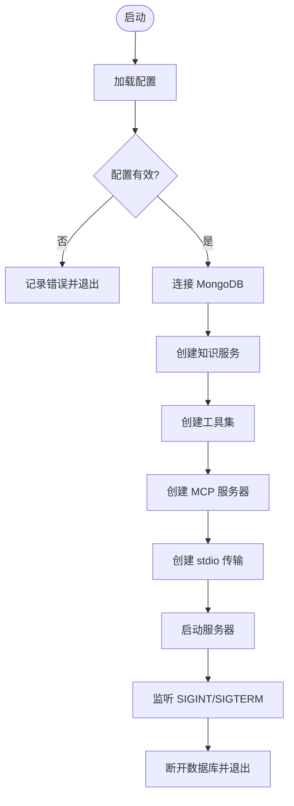
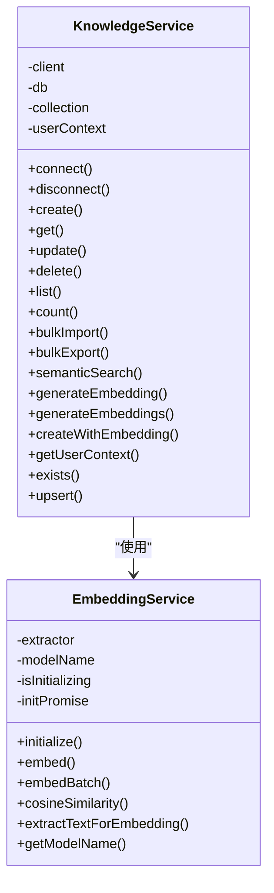
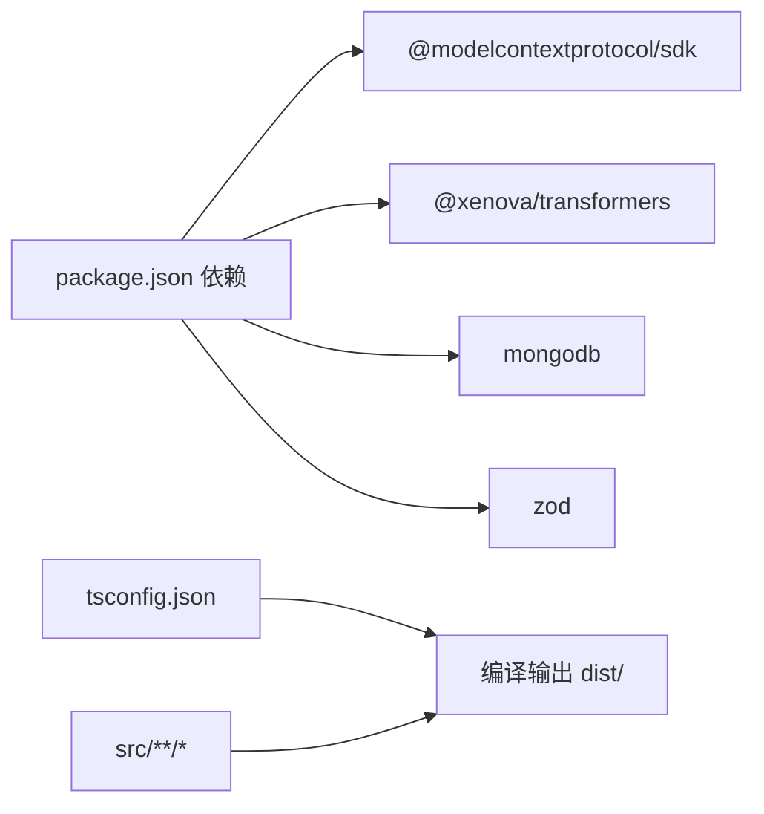

# 技术架构

<cite>
**本文引用的文件**
- [package.json](file://package.json)
- [tsconfig.json](file://tsconfig.json)
- [src/index.ts](file://src/index.ts)
- [src/types.ts](file://src/types.ts)
- [src/utils/config.ts](file://src/utils/config.ts)
- [src/services/embedding-service.ts](file://src/services/embedding-service.ts)
- [src/services/knowledge-service.ts](file://src/services/knowledge-service.ts)
- [src/tools/knowledge-tools.ts](file://src/tools/knowledge-tools.ts)
- [examples/mcp-config.json](file://examples/mcp-config.json)
</cite>

## 目录
1. [简介](#简介)
2. [项目结构](#项目结构)
3. [核心组件](#核心组件)
4. [架构总览](#架构总览)
5. [详细组件分析](#详细组件分析)
6. [依赖关系分析](#依赖关系分析)
7. [性能考虑](#性能考虑)
8. [故障排查指南](#故障排查指南)
9. [结论](#结论)

## 简介
本项目是 MongoDB MCP Server，旨在为跨 IDE 的知识库管理提供统一的 MCP（Model Context Protocol）服务器能力。系统围绕“知识库”这一核心抽象，支持八种知识类型（记忆、技能、规则、MCP 配置、经验、命令、上下文、工作流），并通过 MongoDB 实现持久化与跨设备同步，结合 Transformers.js 实现可选的向量嵌入与语义检索能力。项目采用 TypeScript 开发，使用模块化设计与分层架构，确保可维护性与扩展性。

## 项目结构
项目采用按职责分层的模块化组织方式：
- 入口与协议适配：src/index.ts 作为 MCP 服务器入口，基于 @modelcontextprotocol/sdk 构建 stdio 传输的 MCP 服务器。
- 类型定义：src/types.ts 定义了统一的知识文档类型体系与查询参数。
- 工具集：src/tools/knowledge-tools.ts 将知识库操作封装为 MCP 工具，覆盖 CRUD、快捷工具、批量导出等。
- 服务层：src/services/knowledge-service.ts 提供知识库的增删改查、统计、批量导入导出、语义搜索与嵌入生成等能力；src/services/embedding-service.ts 提供基于 Transformers.js 的文本向量提取与相似度计算。
- 配置与日志：src/utils/config.ts 负责从环境变量加载与校验配置，并提供简易日志工具。
- 示例配置：examples/mcp-config.json 展示了在不同 IDE（Qoder、Cursor、VS Code 等）中的 MCP 服务器配置方法。

**图表来源**
- [src/index.ts](file://src/index.ts#L1-L148)
- [src/utils/config.ts](file://src/utils/config.ts#L1-L147)
- [src/tools/knowledge-tools.ts](file://src/tools/knowledge-tools.ts#L1-L1093)
- [src/services/knowledge-service.ts](file://src/services/knowledge-service.ts#L1-L404)
- [src/services/embedding-service.ts](file://src/services/embedding-service.ts#L1-L148)

**章节来源**
- [package.json](file://package.json#L1-L48)
- [tsconfig.json](file://tsconfig.json#L1-L21)

## 核心组件
- MCP 服务器：负责接收 MCP 请求、列举与调用工具、通过 stdio 与客户端通信。
- 知识库服务：提供统一的知识文档 CRUD、统计、批量操作、语义搜索与嵌入生成。
- 嵌入服务：基于 Transformers.js 的特征提取与余弦相似度计算，支持懒加载与批处理。
- 配置管理器：从环境变量加载与校验配置，生成日志工具。
- 知识工具集：将知识库能力封装为 MCP 工具，包含通用 CRUD、快捷工具、批量导出以及可选的语义搜索与嵌入生成功能。

**章节来源**
- [src/index.ts](file://src/index.ts#L1-L148)
- [src/services/knowledge-service.ts](file://src/services/knowledge-service.ts#L1-L404)
- [src/services/embedding-service.ts](file://src/services/embedding-service.ts#L1-L148)
- [src/utils/config.ts](file://src/utils/config.ts#L1-L147)
- [src/tools/knowledge-tools.ts](file://src/tools/knowledge-tools.ts#L1-L1093)

## 架构总览
系统采用分层架构与模块化设计：
- 表现层：MCP 服务器通过 stdio 与 IDE 客户端交互。
- 业务层：知识工具集将业务逻辑封装为可复用的工具。
- 服务层：知识服务与嵌入服务分别负责数据访问与向量化能力。
- 数据层：MongoDB 存储知识文档，支持索引优化与跨设备同步。

**图表来源**
- [src/index.ts](file://src/index.ts#L16-L82)
- [src/tools/knowledge-tools.ts](file://src/tools/knowledge-tools.ts#L36-L106)
- [src/services/knowledge-service.ts](file://src/services/knowledge-service.ts#L111-L127)
- [src/services/embedding-service.ts](file://src/services/embedding-service.ts#L56-L65)

## 详细组件分析

### MCP 服务器（入口与协议适配）
- 职责：创建 MCP 服务器实例，注册 ListTools 与 CallTool 处理器，通过 stdio 传输与客户端通信。
- 控制流：主函数加载配置、校验配置、连接 MongoDB、创建知识服务与工具集、启动服务器并监听信号进行优雅退出。
- 错误处理：对未知工具与运行时异常进行统一错误包装并返回 JSON 字符串。

**图表来源**
- [src/index.ts](file://src/index.ts#L87-L145)

**章节来源**
- [src/index.ts](file://src/index.ts#L1-L148)

### 知识库服务（数据访问与业务逻辑）
- 职责：统一管理八种知识类型，提供 CRUD、统计、批量导入导出、语义搜索与嵌入生成。
- 数据模型：以 KnowledgeDocument 为核心，派生出 MemoryDocument、SkillDocument、RuleDocument、ExperienceDocument、CommandDocument、ContextDocument、WorkflowDocument、McpDocument 等类型。
- 索引策略：为用户级唯一性、类型过滤、标签过滤、时间排序与跨设备同步建立复合索引。
- 语义搜索：基于嵌入服务生成查询向量，计算余弦相似度并按阈值与数量限制返回结果。
- 嵌入生成：支持单条与批量生成，写入 embedding、embeddingModel、embeddedAt 字段。

**图表来源**
- [src/services/knowledge-service.ts](file://src/services/knowledge-service.ts#L20-L403)
- [src/services/embedding-service.ts](file://src/services/embedding-service.ts#L11-L147)

**章节来源**
- [src/services/knowledge-service.ts](file://src/services/knowledge-service.ts#L1-L404)
- [src/types.ts](file://src/types.ts#L1-L269)

### 嵌入服务（向量特征提取）
- 职责：基于 Transformers.js 的 feature-extraction 管线生成文本向量，支持懒加载、批处理与余弦相似度计算。
- 模型选择：默认模型为 Xenova/all-MiniLM-L6-v2，支持自定义模型名。
- 性能特性：初始化互斥与 Promise 缓存避免重复加载；批处理逐条生成向量；文本截断与拼接提升稳定性。

**章节来源**
- [src/services/embedding-service.ts](file://src/services/embedding-service.ts#L1-L148)

### 配置管理器（环境变量与日志）
- 职责：从环境变量加载配置，解析 IDE 来源、布尔值与日志级别，提供简单日志工具。
- 配置优先级：MCP 客户端传入 env > 系统环境变量 > 默认值。
- 校验规则：要求 MONGO_URI、MONGO_DATABASE、MONGO_COLLECTION 至少三项存在。

**章节来源**
- [src/utils/config.ts](file://src/utils/config.ts#L1-L147)

### 知识工具集（MCP 工具封装）
- 职责：将知识库能力封装为 MCP 工具，包括通用 CRUD、快捷工具（记忆、经验、命令、上下文、MCP/规则/技能同步、工作流）、批量导出、以及可选的语义搜索与嵌入生成功能。
- 输入校验：使用 Zod Schema（由 SDK 提供）进行参数校验，工具内部再做业务异常处理。
- 可选嵌入：当 ENABLE_EMBEDDING 为真时，动态注入语义搜索与嵌入生成工具。

**章节来源**
- [src/tools/knowledge-tools.ts](file://src/tools/knowledge-tools.ts#L1-L1093)

## 依赖关系分析
- 运行时依赖：@modelcontextprotocol/sdk（MCP 协议）、@xenova/transformers（向量模型）、mongodb（数据库驱动）、zod（参数校验）。
- 开发依赖：TypeScript、ESLint、tsx（开发热重载）、类型声明等。
- 构建配置：ESNext 模块、ES2022 目标、严格模式、声明与 sourceMap 输出。

**图表来源**
- [package.json](file://package.json#L30-L43)
- [tsconfig.json](file://tsconfig.json#L1-L21)

**章节来源**
- [package.json](file://package.json#L1-L48)
- [tsconfig.json](file://tsconfig.json#L1-L21)

## 性能考虑
- 数据库索引：针对用户维度与常用查询字段建立复合索引，减少查询成本。
- 嵌入懒加载：首次使用时加载模型，避免冷启动开销；并发初始化互斥，防止重复加载。
- 批量处理：嵌入服务支持逐条生成，便于控制内存与吞吐；知识服务批量生成嵌入时逐条写回，保证一致性。
- 查询限制：语义搜索支持 limit 与阈值过滤，避免返回过多结果。
- 日志级别：通过配置控制日志输出，生产环境建议使用 info 或更高级别。

[本节为通用性能建议，无需特定文件引用]

## 故障排查指南
- 启动失败：检查 MONGO_URI、MONGO_DATABASE、MONGO_COLLECTION 是否正确配置；查看日志输出定位具体错误。
- 工具调用失败：确认工具名是否存在；检查工具输入参数是否符合 Schema；查看返回的 JSON 错误信息。
- 语义搜索无结果：确认已生成嵌入；检查阈值与 limit 设置；验证 ENABLE_EMBEDDING 是否开启。
- 嵌入模型加载慢：首次加载模型耗时较长属正常；可在空闲时段预热或调整模型大小。
- 数据库连接问题：确认 MongoDB 地址可达、认证信息正确、网络策略允许访问。

**章节来源**
- [src/index.ts](file://src/index.ts#L94-L98)
- [src/tools/knowledge-tools.ts](file://src/tools/knowledge-tools.ts#L46-L54)
- [src/services/knowledge-service.ts](file://src/services/knowledge-service.ts#L272-L299)

## 结论
MongoDB MCP Server 通过清晰的分层架构与模块化设计，将知识库管理能力以 MCP 工具的形式暴露给多种 IDE。借助 MongoDB 的强一致与索引能力，系统实现了跨设备的知识同步；通过可选的嵌入服务，提供了语义搜索能力。项目采用 TypeScript 与严格的类型定义，配合 ESLint 与 tsconfig 配置，确保了代码质量与可维护性。未来可进一步扩展工具集、优化嵌入模型与索引策略，并引入缓存与异步任务队列以提升大规模数据场景下的性能。