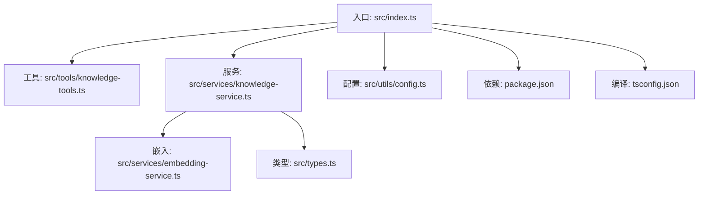
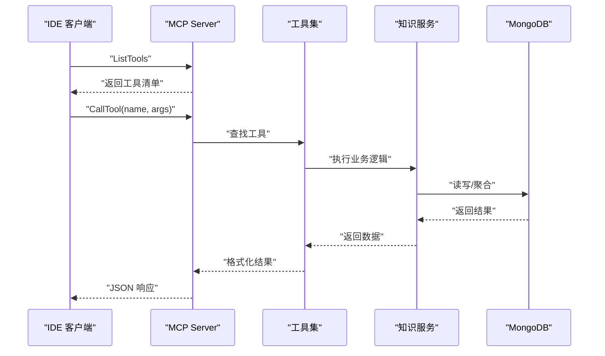
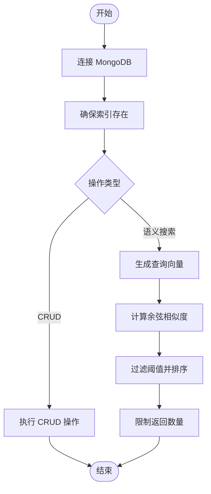
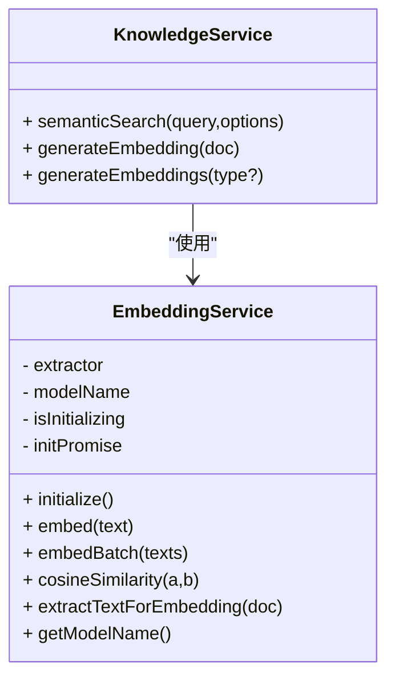
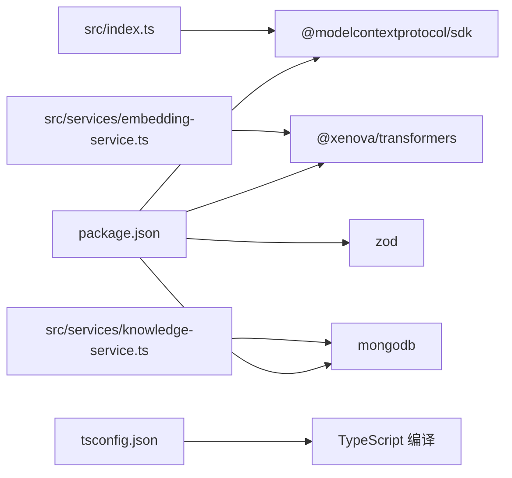

# 技术栈

<cite>
**本文引用的文件**
- [package.json](file://package.json)
- [tsconfig.json](file://tsconfig.json)
- [src/index.ts](file://src/index.ts)
- [src/types.ts](file://src/types.ts)
- [src/utils/config.ts](file://src/utils/config.ts)
- [src/services/knowledge-service.ts](file://src/services/knowledge-service.ts)
- [src/services/embedding-service.ts](file://src/services/embedding-service.ts)
- [src/tools/knowledge-tools.ts](file://src/tools/knowledge-tools.ts)
- [examples/mcp-config.json](file://examples/mcp-config.json)
</cite>

## 目录
1. [简介](#简介)
2. [项目结构](#项目结构)
3. [核心组件](#核心组件)
4. [架构总览](#架构总览)
5. [详细组件分析](#详细组件分析)
6. [依赖关系分析](#依赖关系分析)
7. [性能与可扩展性](#性能与可扩展性)
8. [版本兼容性矩阵](#版本兼容性矩阵)
9. [升级路径与迁移建议](#升级路径与迁移建议)
10. [故障排查指南](#故障排查指南)
11. [结论](#结论)

## 简介
本项目是一个基于 Node.js 与 TypeScript 的 MongoDB MCP Server，采用 Model Context Protocol（MCP）协议实现跨 IDE 的知识库管理与工具调用。其核心目标是通过统一的 MCP 接口，将 MongoDB 作为持久化层，结合 @xenova/transformers 提供的机器学习嵌入能力，实现记忆、技能、规则、MCP 配置、经验、命令、上下文与工作流等八类知识的统一管理与检索。

技术选型围绕以下目标展开：
- 使用 Node.js + TypeScript 构建高性能、类型安全的 MCP 服务；
- 使用 MongoDB 作为结构化与向量混合存储；
- 使用 @modelcontextprotocol/sdk 实现标准 MCP 协议；
- 使用 @xenova/transformers 提供本地化的文本嵌入能力；
- 通过严格的配置校验与日志体系保障运行稳定性。

## 项目结构
项目采用按功能域分层的组织方式：
- 入口与协议适配：src/index.ts 作为 MCP 服务入口，负责创建 stdio 传输与请求处理器；
- 业务服务层：src/services 下包含知识服务与嵌入服务，分别负责数据访问与向量计算；
- 工具层：src/tools 定义 MCP 工具集合，封装知识库 CRUD 与快捷操作；
- 类型与配置：src/types.ts 定义知识文档类型与查询参数；src/utils/config.ts 负责配置加载与校验；
- 示例与配置：examples/mcp-config.json 展示了在不同 IDE 中的 MCP 服务配置方法。



图表来源
- [src/index.ts](file://src/index.ts#L1-L148)
- [src/tools/knowledge-tools.ts](file://src/tools/knowledge-tools.ts#L1-L1093)
- [src/services/knowledge-service.ts](file://src/services/knowledge-service.ts#L1-L404)
- [src/services/embedding-service.ts](file://src/services/embedding-service.ts#L1-L148)
- [src/types.ts](file://src/types.ts#L1-L269)
- [src/utils/config.ts](file://src/utils/config.ts#L1-L147)
- [package.json](file://package.json#L1-L48)
- [tsconfig.json](file://tsconfig.json#L1-L21)

章节来源
- [src/index.ts](file://src/index.ts#L1-L148)
- [src/tools/knowledge-tools.ts](file://src/tools/knowledge-tools.ts#L1-L1093)
- [src/services/knowledge-service.ts](file://src/services/knowledge-service.ts#L1-L404)
- [src/services/embedding-service.ts](file://src/services/embedding-service.ts#L1-L148)
- [src/types.ts](file://src/types.ts#L1-L269)
- [src/utils/config.ts](file://src/utils/config.ts#L1-L147)
- [package.json](file://package.json#L1-L48)
- [tsconfig.json](file://tsconfig.json#L1-L21)

## 核心组件
- MCP 协议适配与传输
  - 使用 @modelcontextprotocol/sdk 的 Server 与 StdioServerTransport，以 stdio 模式与 IDE 通信；
  - 定义 ListTools 与 CallTool 请求处理器，暴露知识库管理工具集。
- 知识服务（KnowledgeService）
  - 封装 MongoDB 连接、索引、CRUD、批量导入导出、统计与语义搜索；
  - 支持用户上下文隔离与跨设备同步（通过 userId/deviceId/ideSource）。
- 嵌入服务（EmbeddingService）
  - 基于 @xenova/transformers 的 feature-extraction 模型，提供文本向量化与余弦相似度计算；
  - 支持懒加载与单例模式，降低初始化成本。
- 工具集（MCP Tools）
  - 提供通用 CRUD 工具与快捷工具（记忆、经验、命令、上下文、MCP 同步、规则同步等）；
  - 输入参数通过 Zod Schema 校验（由 SDK 内部处理），工具返回统一结构。
- 配置与日志
  - 从环境变量加载配置，支持 IDE 来源、日志级别、嵌入开关等；
  - 提供基础日志工具，按级别输出。

章节来源
- [src/index.ts](file://src/index.ts#L1-L148)
- [src/services/knowledge-service.ts](file://src/services/knowledge-service.ts#L1-L404)
- [src/services/embedding-service.ts](file://src/services/embedding-service.ts#L1-L148)
- [src/tools/knowledge-tools.ts](file://src/tools/knowledge-tools.ts#L1-L1093)
- [src/utils/config.ts](file://src/utils/config.ts#L1-L147)

## 架构总览
系统采用“MCP 协议适配层 + 业务服务层 + 存储层”的分层架构。MCP 服务通过 stdio 与 IDE 交互，内部将请求路由到工具集，工具集调用知识服务进行数据操作，知识服务根据需要调用嵌入服务生成向量，最终持久化至 MongoDB。

```mermaid
graph TB
subgraph "IDE"
IDE["IDE 客户端<br/>MCP 客户端"]
end
subgraph "MCP 服务"
Srv["MCP Server<br/>src/index.ts"]
Tools["MCP 工具集<br/>src/tools/knowledge-tools.ts"]
KSvc["知识服务<br/>src/services/knowledge-service.ts"]
Emb["嵌入服务<br/>src/services/embedding-service.ts"]
end
subgraph "存储"
Mongo["MongoDB"]
end
IDE --> |"stdio"| Srv
Srv --> Tools
Tools --> KSvc
KSvc --> |"读写"| Mongo
KSvc --> Emb
Emb --> |"特征向量"| Mongo
```

图表来源
- [src/index.ts](file://src/index.ts#L1-L148)
- [src/tools/knowledge-tools.ts](file://src/tools/knowledge-tools.ts#L1-L1093)
- [src/services/knowledge-service.ts](file://src/services/knowledge-service.ts#L1-L404)
- [src/services/embedding-service.ts](file://src/services/embedding-service.ts#L1-L148)

## 详细组件分析

### MCP 协议与传输
- 使用 @modelcontextprotocol/sdk 的 Server 与 StdioServerTransport，以 stdio 模式与 IDE 通信；
- 定义 ListTools 与 CallTool 请求处理器，注册工具集并统一处理工具调用；
- 错误处理：对未知工具与异常进行结构化错误响应，便于客户端展示。



图表来源
- [src/index.ts](file://src/index.ts#L16-L82)
- [src/tools/knowledge-tools.ts](file://src/tools/knowledge-tools.ts#L1-L1093)
- [src/services/knowledge-service.ts](file://src/services/knowledge-service.ts#L1-L404)

章节来源
- [src/index.ts](file://src/index.ts#L1-L148)

### 知识服务（KnowledgeService）
- 连接与断开：通过 MongoClient 连接数据库，创建必要索引；
- 用户上下文注入：在文档创建/更新时注入 userId、deviceId、ideSource；
- 查询与聚合：支持按类型、标签、启用状态、关键词搜索、分页与排序；
- 批量操作：支持批量导入导出与批量生成嵌入；
- 语义搜索：基于嵌入服务生成查询向量，计算余弦相似度并过滤阈值；
- 原子性与一致性：使用 MongoDB 的 upsert、更新 inc、事务（可选）保证同步版本与一致性。



图表来源
- [src/services/knowledge-service.ts](file://src/services/knowledge-service.ts#L44-L87)
- [src/services/knowledge-service.ts](file://src/services/knowledge-service.ts#L272-L299)

章节来源
- [src/services/knowledge-service.ts](file://src/services/knowledge-service.ts#L1-L404)

### 嵌入服务（EmbeddingService）
- 模型懒加载：首次使用时加载 feature-extraction 模型，避免启动时长；
- 文本预处理：从文档中抽取 name/description/content/tags 组成输入文本；
- 向量计算：使用 mean 池化与归一化，支持批量向量生成；
- 相似度计算：提供余弦相似度计算，用于语义搜索。



图表来源
- [src/services/embedding-service.ts](file://src/services/embedding-service.ts#L1-L148)
- [src/services/knowledge-service.ts](file://src/services/knowledge-service.ts#L272-L359)

章节来源
- [src/services/embedding-service.ts](file://src/services/embedding-service.ts#L1-L148)

### 工具集（MCP Tools）
- 通用 CRUD 工具：knowledge_create、knowledge_read、knowledge_update、knowledge_delete、knowledge_list、knowledge_stats、knowledge_upsert；
- 快捷工具：memory_add/memory_search、experience_add、command_add、context_set、mcp_sync、rule_sync 等；
- 输入参数校验：通过工具定义的 inputSchema 描述参数结构；
- 结果统一：返回 success/data/message/error 字段，便于客户端处理。

章节来源
- [src/tools/knowledge-tools.ts](file://src/tools/knowledge-tools.ts#L1-L1093)

### 配置与日志
- 配置来源优先级：MCP 客户端 env > 系统环境变量 > 默认值；
- 校验规则：强制要求 MONGO_URI、MONGO_DATABASE、MONGO_COLLECTION；
- 日志级别：debug/info/warn/error，按级别输出。

章节来源
- [src/utils/config.ts](file://src/utils/config.ts#L1-L147)

## 依赖关系分析
- 运行时依赖
  - @modelcontextprotocol/sdk：实现 MCP 协议与传输；
  - @xenova/transformers：提供本地化文本嵌入；
  - mongodb：MongoDB 官方驱动；
  - zod：类型与校验（由 SDK 内部使用）。
- 开发依赖
  - typescript、@types/node、eslint、tsx 等，用于开发与构建。



图表来源
- [package.json](file://package.json#L30-L42)
- [tsconfig.json](file://tsconfig.json#L1-L21)
- [src/index.ts](file://src/index.ts#L3-L11)
- [src/services/knowledge-service.ts](file://src/services/knowledge-service.ts#L1-L4)
- [src/services/embedding-service.ts](file://src/services/embedding-service.ts#L1-L1)

章节来源
- [package.json](file://package.json#L1-L48)
- [tsconfig.json](file://tsconfig.json#L1-L21)

## 性能与可扩展性
- 向量嵌入
  - 模型懒加载减少启动时间；批量生成嵌入时逐条更新，适合增量处理；
  - 语义搜索通过阈值与限制返回数量控制性能。
- 数据库优化
  - 多字段索引覆盖常用查询（用户+类型、用户+标签、用户+设备、时间排序）；
  - 分页与偏移支持大列表场景。
- 并发与资源
  - 嵌入服务单例避免重复加载模型；
  - 建议在高并发场景下增加连接池与缓存策略（如对热点文档的内存缓存）。

[本节为通用性能讨论，无需具体文件分析]

## 版本兼容性矩阵
以下为项目当前使用的依赖版本与兼容性要点（来源于 package.json 与 tsconfig.json）：

- Node.js
  - 引擎要求：>= 18.0.0
  - 目标：ES2022，模块：ESNext，解析：node
- @modelcontextprotocol/sdk
  - 版本：^1.0.0
  - 兼容性：与 MCP 协议 1.0 对齐，支持 stdio 传输
- @xenova/transformers
  - 版本：^2.17.2
  - 兼容性：feature-extraction 模型可用，禁用本地模型与浏览器缓存
- mongodb
  - 版本：^6.3.0
  - 兼容性：支持现代 MongoDB 特性，注意驱动与服务器版本匹配
- zod
  - 版本：^3.22.4
  - 兼容性：与 SDK 内部校验配合使用
- TypeScript
  - 版本：^5.3.0
  - 编译选项：严格模式、声明文件、sourceMap、declarationMap

章节来源
- [package.json](file://package.json#L44-L46)
- [package.json](file://package.json#L30-L42)
- [tsconfig.json](file://tsconfig.json#L2-L16)

## 升级路径与迁移建议
- Node.js 升级
  - 从 18.x 升级到 20.x 或更高版本时，需验证 ES2022 语法与模块解析行为；
  - 建议在 CI 中增加多版本测试矩阵。
- @modelcontextprotocol/sdk
  - 从 1.x 升级到 2.x 时，关注协议变更与传输接口调整；
  - 建议先在 dev 环境验证 MCP 客户端兼容性。
- @xenova/transformers
  - 从 2.x 升级到 3.x 时，检查 feature-extraction 的 API 变更与模型加载行为；
  - 若更换模型，需重新生成嵌入并更新阈值策略。
- mongodb
  - 从 6.x 升级到 7.x 时，注意驱动 API 变更与弃用特性；
  - 建议在测试环境先行验证索引与查询性能。
- TypeScript
  - 从 5.x 升级到 6.x 时，关注严格模式新增的类型检查；
  - 建议逐步修复类型问题，避免一次性大改。

[本节为通用升级建议，无需具体文件分析]

## 故障排查指南
- 启动失败
  - 检查 MONGO_URI、MONGO_DATABASE、MONGO_COLLECTION 是否正确；
  - 查看日志级别与输出，确认连接与索引创建是否成功。
- 工具调用异常
  - 确认工具名称是否存在于工具集；
  - 检查输入参数是否符合工具定义的 inputSchema；
  - 查看工具 handler 返回的 error 字段。
- 嵌入相关问题
  - 模型加载耗时过长：确认网络与模型缓存配置；
  - 语义搜索结果为空：调整阈值或检查文档是否已生成嵌入。
- IDE 集成问题
  - 参考 examples/mcp-config.json，确保命令、参数与环境变量正确；
  - 不同 IDE 的 MCP 配置文件位置与键名可能不同。

章节来源
- [src/utils/config.ts](file://src/utils/config.ts#L96-L115)
- [src/index.ts](file://src/index.ts#L116-L144)
- [src/tools/knowledge-tools.ts](file://src/tools/knowledge-tools.ts#L1-L1093)
- [examples/mcp-config.json](file://examples/mcp-config.json#L1-L94)

## 结论
本项目通过 Node.js + TypeScript 的现代化技术栈，结合 MCP 协议与 MongoDB，构建了一个可扩展的知识库管理与工具调用平台。@xenova/transformers 提供的本地化嵌入能力，使得语义搜索与智能检索成为可能；严格的配置与日志体系保障了运行稳定性。建议在生产环境中关注模型与驱动的版本升级路径，并结合实际业务场景优化索引与查询策略，以获得更好的性能与可维护性。