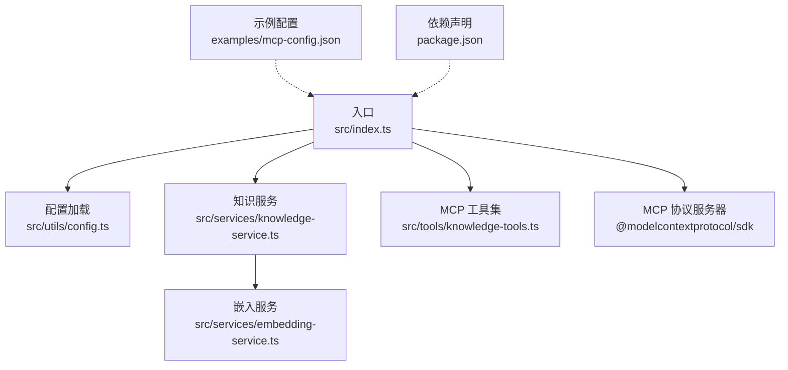
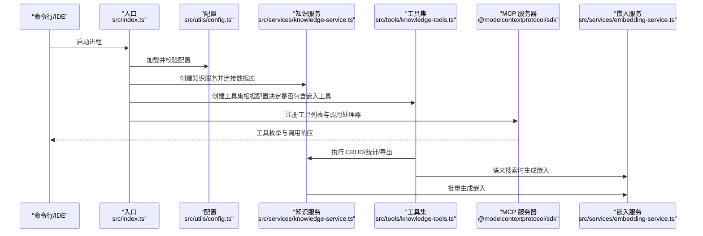
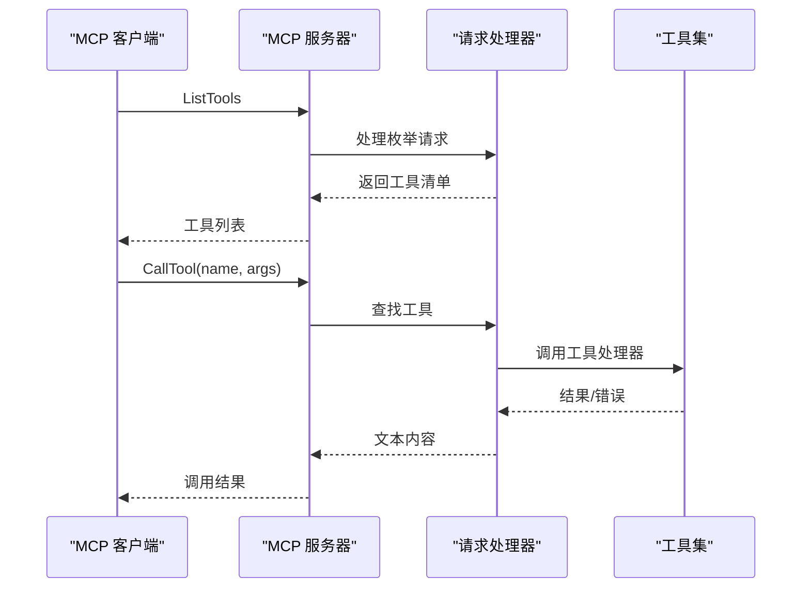
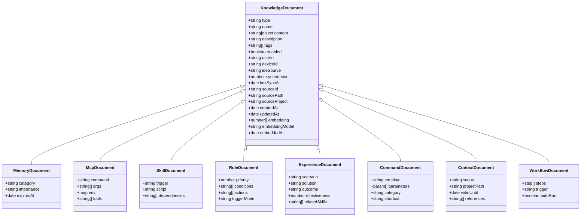
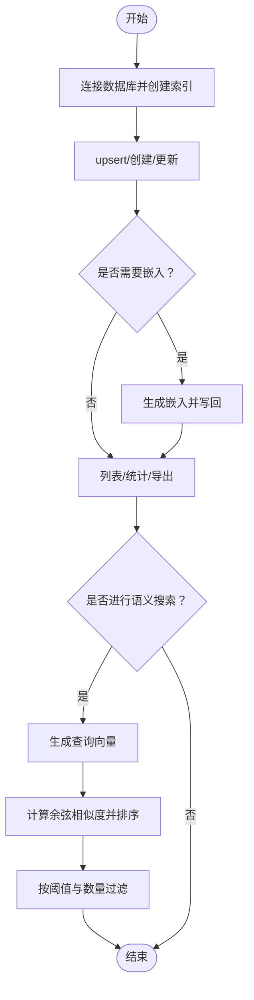
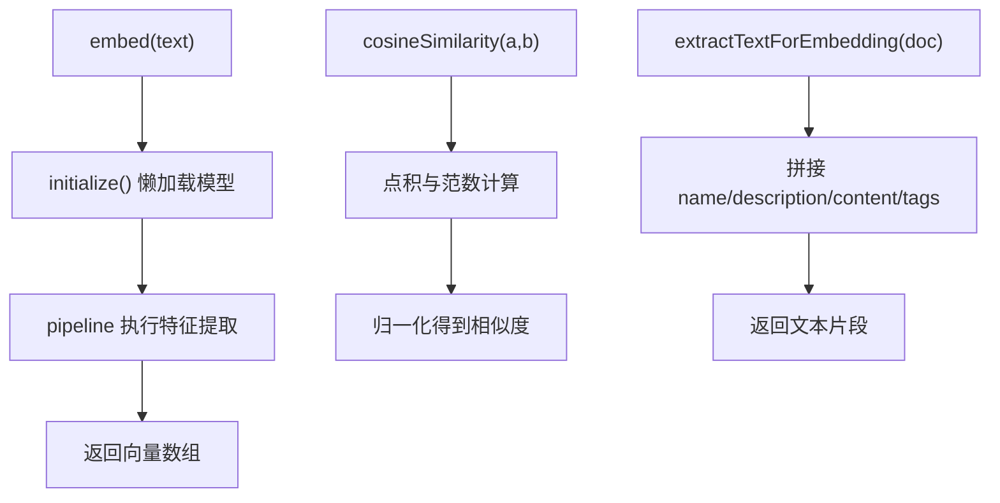
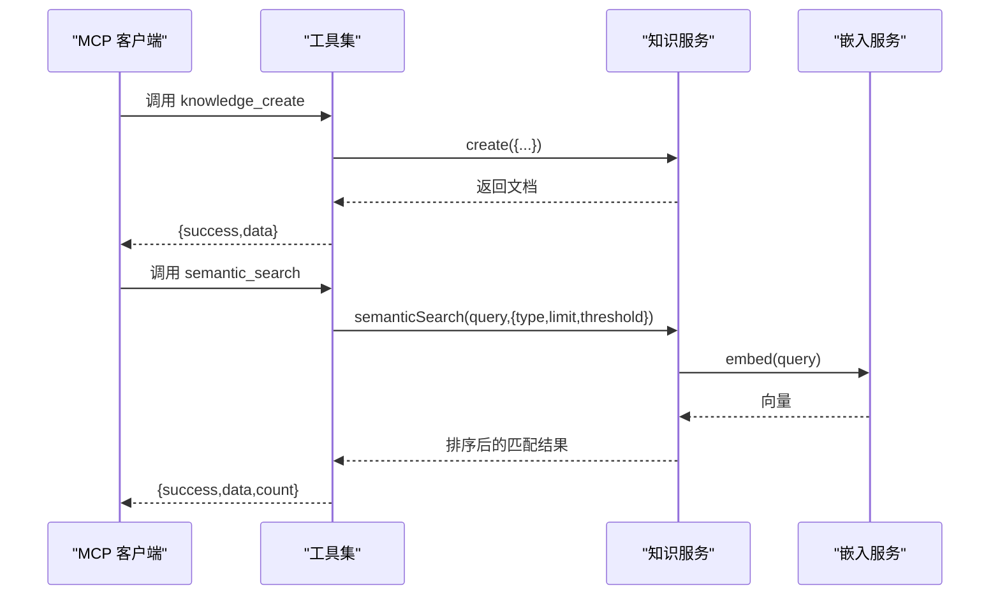
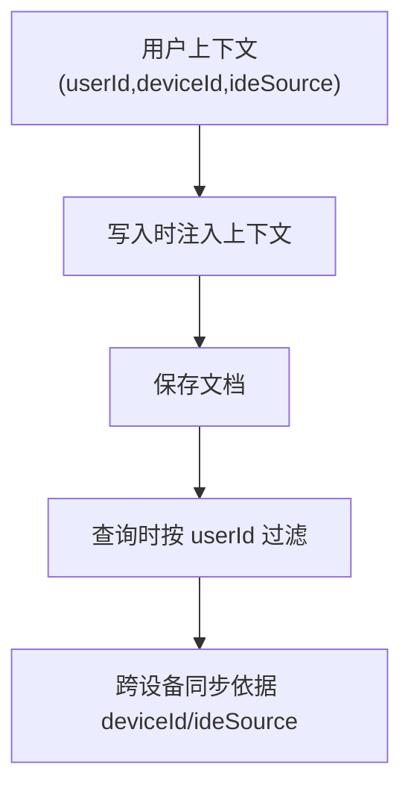
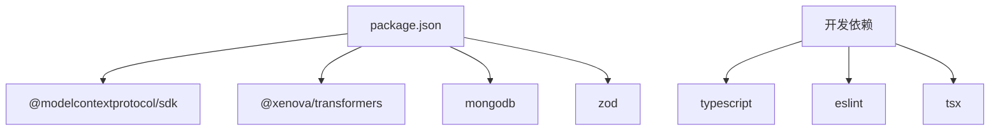

# 核心特性

<cite>
**本文引用的文件**
- [src/index.ts](file://src/index.ts)
- [src/types.ts](file://src/types.ts)
- [src/services/knowledge-service.ts](file://src/services/knowledge-service.ts)
- [src/services/embedding-service.ts](file://src/services/embedding-service.ts)
- [src/tools/knowledge-tools.ts](file://src/tools/knowledge-tools.ts)
- [src/utils/config.ts](file://src/utils/config.ts)
- [examples/mcp-config.json](file://examples/mcp-config.json)
- [package.json](file://package.json)
</cite>

## 目录
1. [简介](#简介)
2. [项目结构](#项目结构)
3. [核心组件](#核心组件)
4. [架构总览](#架构总览)
5. [详细组件分析](#详细组件分析)
6. [依赖关系分析](#依赖关系分析)
7. [性能考量](#性能考量)
8. [故障排查指南](#故障排查指南)
9. [结论](#结论)
10. [附录](#附录)

## 简介
MongoDB MCP Server 是一个基于 MCP（Model Context Protocol）协议的跨 IDE 知识库管理服务器，通过标准协议与各类 IDE/客户端交互，提供统一的知识管理能力。其核心特性包括：
- MCP 协议服务器实现：以标准协议暴露工具接口，便于在不同 IDE 中集成
- 八大知识类型管理：Memories、Skills、Rules、MCPs、Experiences、Commands、Contexts、Workflows
- 向量嵌入搜索：基于 Transformers.js 的本地嵌入生成与余弦相似度检索
- 多用户隔离与跨设备同步：通过用户、设备、IDE 三元上下文实现隔离与同步
- 跨 IDE 集成：提供多 IDE 的配置示例，支持本地与云端数据库

这些特性共同构成“智能化、自动化”的知识管理方案，相比传统知识管理工具，具备更强的可移植性、可扩展性和跨平台一致性。

## 项目结构
项目采用分层设计，核心目录与职责如下：
- src/index.ts：入口与服务器初始化，负责加载配置、创建知识服务、注册工具、启动 MCP 服务器
- src/types.ts：定义八种知识类型及通用字段、查询与嵌入选项
- src/services/knowledge-service.ts：知识库服务，封装 CRUD、聚合、统计、批量导入导出、语义搜索与嵌入生成
- src/services/embedding-service.ts：嵌入服务，使用 Transformers.js 生成文本向量，计算余弦相似度
- src/tools/knowledge-tools.ts：MCP 工具集合，提供通用 CRUD、快捷工具、同步工具、导出工具以及可选的语义搜索与嵌入工具
- src/utils/config.ts：配置加载、校验与日志工具
- examples/mcp-config.json：多 IDE 的 MCP 配置示例
- package.json：项目依赖与脚本

图表来源
- [src/index.ts](file://src/index.ts#L1-L148)
- [src/utils/config.ts](file://src/utils/config.ts#L76-L91)
- [src/services/knowledge-service.ts](file://src/services/knowledge-service.ts#L20-L87)
- [src/services/embedding-service.ts](file://src/services/embedding-service.ts#L11-L51)
- [src/tools/knowledge-tools.ts](file://src/tools/knowledge-tools.ts#L29-L33)
- [examples/mcp-config.json](file://examples/mcp-config.json#L1-L94)
- [package.json](file://package.json#L30-L35)

章节来源
- [src/index.ts](file://src/index.ts#L1-L148)
- [package.json](file://package.json#L1-L48)

## 核心组件
- MCP 协议服务器：基于 SDK 创建服务器，注册工具列表与调用处理器，支持工具枚举与调用
- 知识服务：封装 MongoDB 连接、索引、CRUD、聚合、统计、批量操作、语义搜索与嵌入生成
- 嵌入服务：懒加载模型、批量嵌入、余弦相似度计算、文本抽取
- 工具集：通用 CRUD、快捷工具、同步工具、导出工具、可选语义搜索与嵌入工具
- 配置与日志：从环境变量加载配置、校验、日志输出

章节来源
- [src/index.ts](file://src/index.ts#L16-L82)
- [src/services/knowledge-service.ts](file://src/services/knowledge-service.ts#L20-L87)
- [src/services/embedding-service.ts](file://src/services/embedding-service.ts#L11-L51)
- [src/tools/knowledge-tools.ts](file://src/tools/knowledge-tools.ts#L29-L33)
- [src/utils/config.ts](file://src/utils/config.ts#L76-L146)

## 架构总览
MCP 服务器启动流程与组件交互如下：

图表来源
- [src/index.ts](file://src/index.ts#L87-L145)
- [src/utils/config.ts](file://src/utils/config.ts#L76-L91)
- [src/services/knowledge-service.ts](file://src/services/knowledge-service.ts#L44-L54)
- [src/tools/knowledge-tools.ts](file://src/tools/knowledge-tools.ts#L29-L33)
- [src/services/embedding-service.ts](file://src/services/embedding-service.ts#L24-L51)

## 详细组件分析

### MCP 协议服务器实现
- 服务器创建：设置名称与版本，声明工具能力
- 工具枚举：返回工具清单（名称、描述、输入模式）
- 工具调用：按名称路由到对应工具处理器，异常捕获并返回结构化错误
- 生命周期：优雅关闭，断开数据库连接

图表来源
- [src/index.ts](file://src/index.ts#L30-L79)

章节来源
- [src/index.ts](file://src/index.ts#L16-L82)

### 八大知识类型管理
- 类型定义：Memories、Skills、Rules、MCPs、Experiences、Commands、Contexts、Workflows
- 文档结构：统一字段（类型、名称、内容、描述、标签、启用状态、用户/设备/IDE 上下文、同步版本、时间戳、向量嵌入等）
- 特殊类型：
  - Memories：记忆，支持分类、重要性、过期时间
  - Skills：技能，支持触发条件、脚本、依赖
  - Rules：规则，支持优先级、条件/动作、触发方式
  - MCPs：MCP 配置，支持命令、参数、环境变量、工具列表
  - Experiences：经验，支持场景、方案、结果、评分、关联技能
  - Commands：命令，支持模板、参数、分类、快捷别名
  - Contexts：上下文，支持范围、项目路径、有效期、参考资料
  - Workflows：工作流，支持步骤、触发条件、自动执行

图表来源
- [src/types.ts](file://src/types.ts#L24-L223)

章节来源
- [src/types.ts](file://src/types.ts#L6-L223)

### 知识服务：CRUD、聚合、统计、批量与嵌入
- 连接与索引：连接 MongoDB，确保用户级唯一索引、类型/标签/时间排序索引
- 用户上下文：注入 userId/deviceId/ideSource，所有操作均以用户维度过滤
- CRUD：创建、读取、更新（含同步版本递增）、删除、存在性检查
- 列表与统计：支持类型/标签/启用状态/关键词搜索、分页、计数
- 批量：批量导入、批量导出
- 语义搜索：生成查询向量，对已有嵌入文档计算相似度，按阈值与数量过滤
- 嵌入生成：抽取文本、调用嵌入模型、写回向量与元信息

图表来源
- [src/services/knowledge-service.ts](file://src/services/knowledge-service.ts#L44-L54)
- [src/services/knowledge-service.ts](file://src/services/knowledge-service.ts#L346-L359)
- [src/services/knowledge-service.ts](file://src/services/knowledge-service.ts#L272-L299)
- [src/services/embedding-service.ts](file://src/services/embedding-service.ts#L56-L65)

章节来源
- [src/services/knowledge-service.ts](file://src/services/knowledge-service.ts#L20-L403)

### 嵌入服务：本地向量生成与相似度计算
- 懒加载模型：首次使用时加载特征提取模型，避免启动开销
- 批量嵌入：逐条生成并返回向量数组
- 文本抽取：从文档中抽取 name/description/content/tags 等组成文本
- 相似度：余弦相似度计算，支持阈值过滤

图表来源
- [src/services/embedding-service.ts](file://src/services/embedding-service.ts#L24-L51)
- [src/services/embedding-service.ts](file://src/services/embedding-service.ts#L56-L104)
- [src/services/embedding-service.ts](file://src/services/embedding-service.ts#L109-L129)

章节来源
- [src/services/embedding-service.ts](file://src/services/embedding-service.ts#L11-L148)

### MCP 工具集：通用 CRUD、快捷工具、同步与导出
- 通用工具：knowledge_create、knowledge_read、knowledge_update、knowledge_delete、knowledge_list、knowledge_stats、knowledge_upsert
- 快捷工具：memory_add/memory_search、experience_add、command_add、context_set
- 同步工具：mcp_sync、rule_sync、skill_sync、workflow_create
- 导出工具：knowledge_export
- 可选工具：semantic_search、generate_embeddings（由配置开关控制）

图表来源
- [src/tools/knowledge-tools.ts](file://src/tools/knowledge-tools.ts#L36-L107)
- [src/tools/knowledge-tools.ts](file://src/tools/knowledge-tools.ts#L1002-L1056)
- [src/services/knowledge-service.ts](file://src/services/knowledge-service.ts#L272-L299)
- [src/services/embedding-service.ts](file://src/services/embedding-service.ts#L56-L65)

章节来源
- [src/tools/knowledge-tools.ts](file://src/tools/knowledge-tools.ts#L29-L1093)

### 多用户隔离与跨设备同步
- 用户隔离：所有查询与写入均以 userId 过滤，确保用户间数据隔离
- 设备与 IDE：记录 deviceId 与 ideSource，支持跨设备同步与来源追踪
- 同步版本：每次更新递增 syncVersion，便于冲突检测与增量同步
- 索引策略：为 userId + type/name、userId + deviceId、userId + tags、userId + updatedAt 建立索引，优化查询与排序

图表来源
- [src/services/knowledge-service.ts](file://src/services/knowledge-service.ts#L92-L106)
- [src/services/knowledge-service.ts](file://src/services/knowledge-service.ts#L74-L87)
- [src/types.ts](file://src/types.ts#L39-L51)

章节来源
- [src/services/knowledge-service.ts](file://src/services/knowledge-service.ts#L20-L87)
- [src/types.ts](file://src/types.ts#L39-L74)

### 跨 IDE 集成
- 配置示例覆盖 Qoder、Cursor、VS Code 等 IDE
- 支持本地与云端数据库，灵活设置 USER_ID、DEVICE_ID、IDE_SOURCE、ENABLE_EMBEDDING 等
- 通过 npx 或本地构建路径启动，便于在不同环境中部署

章节来源
- [examples/mcp-config.json](file://examples/mcp-config.json#L1-L94)
- [package.json](file://package.json#L10-L16)

## 依赖关系分析
- 运行时依赖：@modelcontextprotocol/sdk（MCP 协议）、@xenova/transformers（嵌入）、mongodb（数据库）、zod（类型校验）
- 开发依赖：TypeScript、ESLint、tsx（热重载开发）
- 脚本：构建、运行、开发、类型检查、代码规范

图表来源
- [package.json](file://package.json#L30-L46)

章节来源
- [package.json](file://package.json#L1-L48)

## 性能考量
- 嵌入生成批量化：批量生成嵌入时逐条处理，建议按类型分批或在空闲时段执行
- 查询索引：确保常用过滤字段（type/tags/updatedAt）建立索引，减少全表扫描
- 语义搜索：阈值与返回数量可调，避免高成本的全库相似度计算
- 懒加载模型：首次使用才加载嵌入模型，降低启动延迟
- 并发与资源：生产环境建议限制并发、监控内存与 CPU 使用

## 故障排查指南
- 配置校验失败：检查 MONGO_URI、MONGO_DATABASE、MONGO_COLLECTION 是否正确
- 数据库连接失败：确认 MongoDB 地址可达、认证信息正确
- 工具调用错误：查看工具处理器返回的错误信息，核对必填字段与类型
- 嵌入模型加载失败：检查网络与缓存配置，确认模型可用
- 同步问题：检查 deviceId/ideSource 是否一致，确认 syncVersion 是否递增

章节来源
- [src/utils/config.ts](file://src/utils/config.ts#L96-L115)
- [src/index.ts](file://src/index.ts#L93-L98)
- [src/services/knowledge-service.ts](file://src/services/knowledge-service.ts#L44-L54)
- [src/tools/knowledge-tools.ts](file://src/tools/knowledge-tools.ts#L99-L106)

## 结论
MongoDB MCP Server 将 MCP 协议、MongoDB 存储与向量嵌入有机结合，形成一套可移植、可扩展、跨 IDE 的知识管理方案。其八大知识类型覆盖记忆、技能、规则、MCP、经验、命令、上下文与工作流；多用户隔离与跨设备同步保障了数据一致性；语义搜索与嵌入工具提升了智能化检索能力。相比传统知识管理工具，该项目在标准化、自动化与跨平台方面具有显著优势，适合团队协作、个人知识沉淀与智能体增强等多种场景。

## 附录
- 配置项说明（来自环境变量）：
  - MONGO_URI：MongoDB 连接字符串
  - MONGO_DATABASE：数据库名称
  - MONGO_COLLECTION：集合名称
  - USER_ID：用户标识
  - DEVICE_ID：设备标识
  - IDE_SOURCE：IDE 来源（qoder/cursor/vscode 等）
  - ENABLE_EMBEDDING：是否启用嵌入功能
  - LOG_LEVEL：日志级别（debug/info/warn/error）

章节来源
- [src/utils/config.ts](file://src/utils/config.ts#L76-L91)
- [examples/mcp-config.json](file://examples/mcp-config.json#L1-L94)