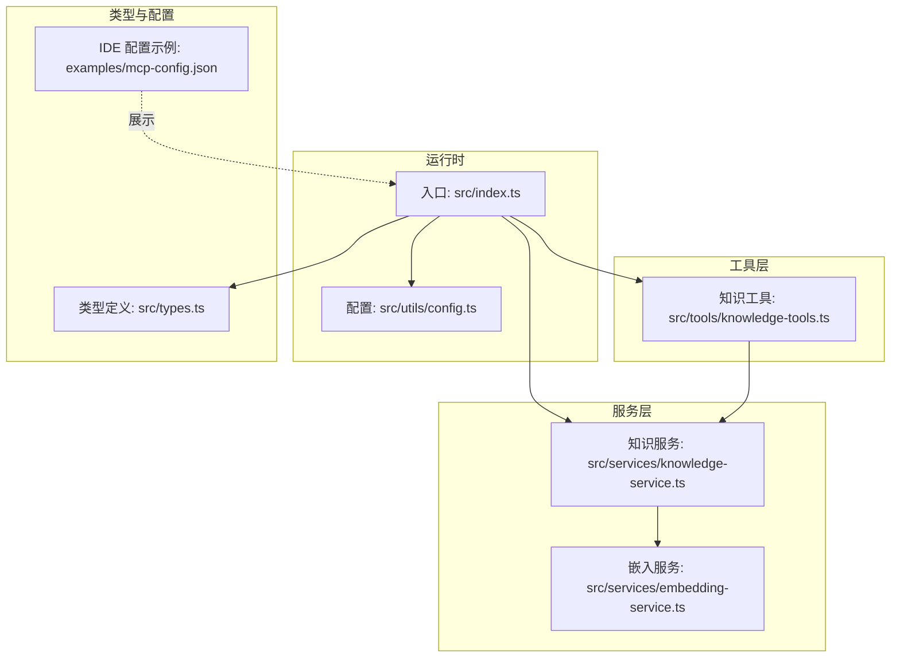
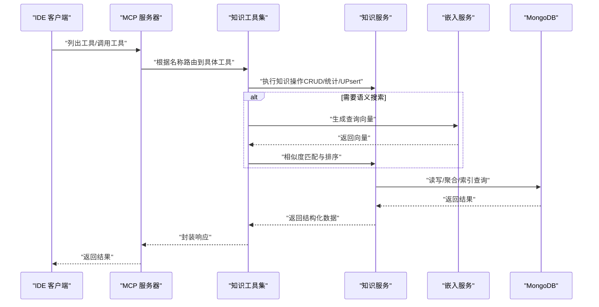
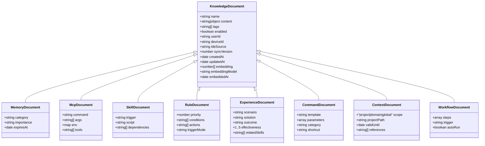
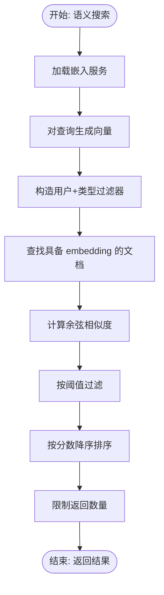
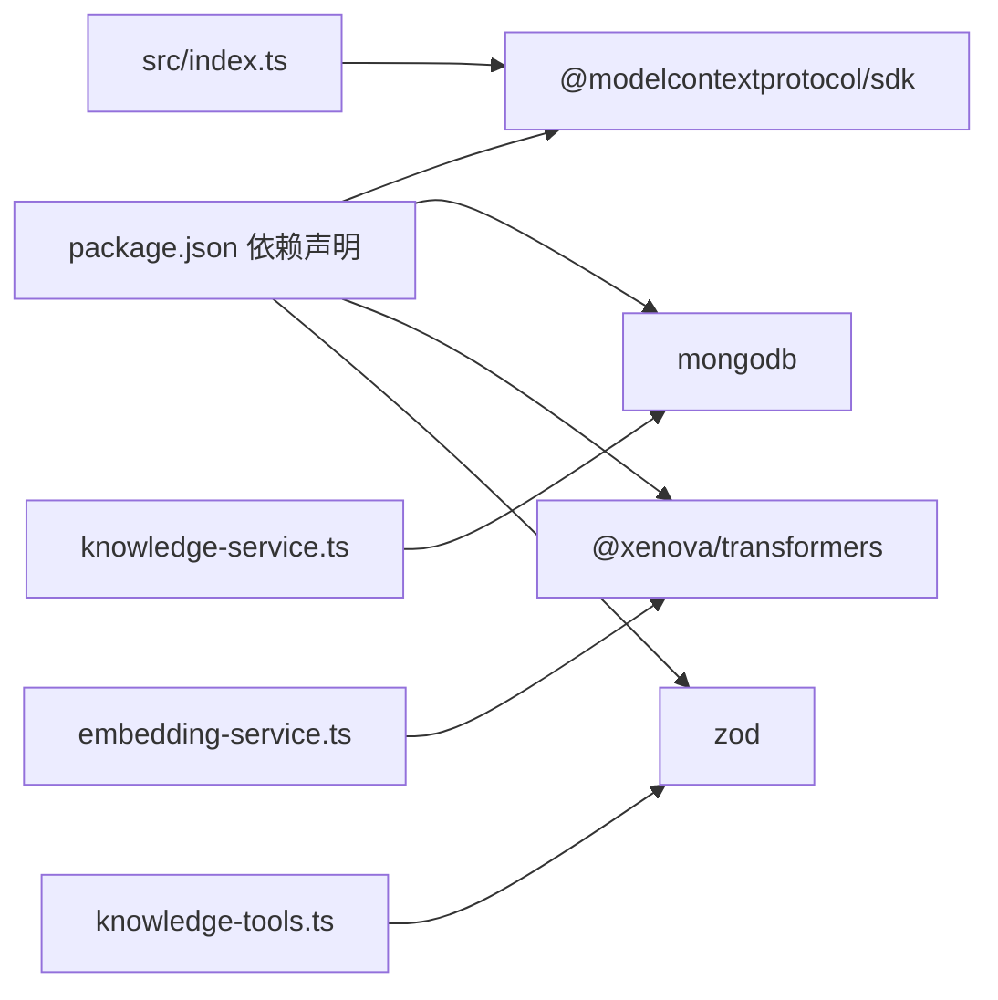

# 项目介绍

<cite>
**本文引用的文件**
- [package.json](file://package.json)
- [src/index.ts](file://src/index.ts)
- [src/types.ts](file://src/types.ts)
- [src/services/knowledge-service.ts](file://src/services/knowledge-service.ts)
- [src/services/embedding-service.ts](file://src/services/embedding-service.ts)
- [src/tools/knowledge-tools.ts](file://src/tools/knowledge-tools.ts)
- [src/utils/config.ts](file://src/utils/config.ts)
- [examples/mcp-config.json](file://examples/mcp-config.json)
- [temp-skills/README.md](file://temp-skills/README.md)
- [temp-skills/skills/mcp-builder/reference/node_mcp_server.md](file://temp-skills/skills/mcp-builder/reference/node_mcp_server.md)
- [temp-skills/skills/algorithmic-art/SKILL.md](file://temp-skills/skills/algorithmic-art/SKILL.md)
- [temp-skills/skills/docx/SKILL.md](file://temp-skills/skills/docx/SKILL.md)
</cite>

## 目录
1. [简介](#简介)
2. [项目结构](#项目结构)
3. [核心组件](#核心组件)
4. [架构总览](#架构总览)
5. [详细组件分析](#详细组件分析)
6. [依赖关系分析](#依赖关系分析)
7. [性能考量](#性能考量)
8. [故障排查指南](#故障排查指南)
9. [结论](#结论)
10. [附录](#附录)

## 简介
MongoDB MCP Server 是一个基于 Model Context Protocol（MCP）协议的跨 IDE 知识库管理工具。其核心使命是为开发者提供统一的知识库平台，支持记忆、技能、规则、MCP 配置、经验、命令、上下文、工作流等多种知识类型的持久化与检索，并通过 MongoDB 实现多用户、多设备、跨 IDE 的同步与共享。

项目的价值主张在于：
- 以 MCP 为标准协议，实现与多种 IDE（如 Qoder、Trae、Cursor、VS Code 等）的无缝集成；
- 借助 MongoDB 的强一致性和灵活文档模型，承载丰富的知识类型与元数据；
- 提供向量嵌入搜索能力，支持语义检索与智能推荐；
- 通过标准化工具集（CRUD、统计、UPsert、快捷工具等）降低知识管理与调用门槛；
- 为 AI 辅助开发场景提供“可执行”的知识载体（技能、工作流、MCP 配置），提升开发效率与一致性。

## 项目结构
项目采用分层与按功能域组织的结构：
- 入口与运行时：src/index.ts 作为 MCP 服务器入口，负责初始化、配置加载、服务连接与工具注册；
- 类型定义：src/types.ts 定义了 8 种知识类型及其字段规范；
- 服务层：src/services 下包含知识服务与嵌入服务，分别负责知识持久化与向量检索；
- 工具层：src/tools 提供 MCP 工具集合，覆盖通用 CRUD、统计、快捷工具与 MCP/规则同步；
- 工具链与配置：src/utils 提供配置解析与日志；examples 展示各 IDE 的 MCP 配置示例；
- 示例技能：temp-skills 展示了 Agent Skills 生态与 MCP Server 的协作模式，涵盖算法艺术、文档处理等场景。

图表来源
- [src/index.ts](file://src/index.ts#L1-L148)
- [src/utils/config.ts](file://src/utils/config.ts#L1-L147)
- [src/services/knowledge-service.ts](file://src/services/knowledge-service.ts#L1-L404)
- [src/services/embedding-service.ts](file://src/services/embedding-service.ts#L1-L148)
- [src/tools/knowledge-tools.ts](file://src/tools/knowledge-tools.ts#L1-L800)
- [src/types.ts](file://src/types.ts#L1-L269)
- [examples/mcp-config.json](file://examples/mcp-config.json#L1-L94)

章节来源
- [package.json](file://package.json#L1-L48)
- [src/index.ts](file://src/index.ts#L1-L148)
- [src/utils/config.ts](file://src/utils/config.ts#L1-L147)
- [examples/mcp-config.json](file://examples/mcp-config.json#L1-L94)

## 核心组件
- MCP 服务器与传输
  - 通过 MCP SDK 初始化服务器，注册工具列表与调用处理器，支持 stdio 传输模式；
  - 在进程退出时优雅断开知识库连接，确保资源释放。
- 知识服务
  - 封装 MongoDB 连接、索引、CRUD、批量导入导出、统计、语义搜索与嵌入生成；
  - 通过用户上下文（用户 ID、设备 ID、IDE 来源）实现用户隔离与跨设备同步。
- 嵌入服务
  - 基于 Transformers.js 的特征提取模型，提供向量生成、余弦相似度计算与文本抽取；
  - 支持懒加载与批处理，兼顾性能与易用性。
- 工具集
  - 提供通用 CRUD、统计、UPsert、快捷工具（记忆、经验、命令、上下文、MCP/规则同步）；
  - 输入参数通过 Zod Schema 进行运行时校验，保证数据一致性与安全性。
- 配置与日志
  - 从环境变量加载配置，支持 IDE 来源、日志级别、嵌入开关等；
  - 提供简单可控的日志输出，便于调试与生产监控。

章节来源
- [src/index.ts](file://src/index.ts#L1-L148)
- [src/services/knowledge-service.ts](file://src/services/knowledge-service.ts#L1-L404)
- [src/services/embedding-service.ts](file://src/services/embedding-service.ts#L1-L148)
- [src/tools/knowledge-tools.ts](file://src/tools/knowledge-tools.ts#L1-L800)
- [src/utils/config.ts](file://src/utils/config.ts#L1-L147)
- [src/types.ts](file://src/types.ts#L1-L269)

## 架构总览
下图展示了从 IDE 到 MCP 服务器、再到知识库与嵌入服务的整体交互流程：

图表来源
- [src/index.ts](file://src/index.ts#L16-L82)
- [src/tools/knowledge-tools.ts](file://src/tools/knowledge-tools.ts#L36-L107)
- [src/services/knowledge-service.ts](file://src/services/knowledge-service.ts#L111-L127)
- [src/services/embedding-service.ts](file://src/services/embedding-service.ts#L56-L65)

## 详细组件分析

### 知识类型与数据模型
项目定义了 8 种知识类型，每种类型对应不同的业务场景与字段约束：
- 记忆（Memories）：对话历史、用户偏好等，支持分类与过期控制；
- 技能（Skills）：可执行脚本与工作流，支持触发条件与依赖；
- 规则（Rules）：行为约束与触发方式，支持优先级与动作列表；
- MCP（MCPs）：MCP 服务器配置，记录命令、参数与工具列表；
- 经验（Experiences）：最佳实践与案例，支持有效性评分与关联技能；
- 命令（Commands）：快捷命令与模板，支持分类与快捷别名；
- 上下文（Contexts）：项目背景与领域知识，支持作用域与有效期；
- 工作流（Workflows）：多步骤流程定义，支持触发条件与错误处理策略。

图表来源
- [src/types.ts](file://src/types.ts#L24-L224)

章节来源
- [src/types.ts](file://src/types.ts#L1-L269)

### 知识服务（KnowledgeService）
- 连接与索引：建立 MongoDB 连接并创建用户级唯一索引、类型查询索引、标签索引与时间排序索引；
- 用户上下文注入：在创建/更新时自动注入 userId、deviceId、ideSource；
- 核心能力：创建、读取、更新、删除、列表、统计、UPsert、批量导入导出；
- 语义搜索：基于嵌入向量的余弦相似度匹配，支持阈值与数量限制；
- 嵌入生成：对文档内容抽取文本并生成向量，支持单条与批量生成。

图表来源
- [src/services/knowledge-service.ts](file://src/services/knowledge-service.ts#L272-L299)
- [src/services/embedding-service.ts](file://src/services/embedding-service.ts#L85-L104)

章节来源
- [src/services/knowledge-service.ts](file://src/services/knowledge-service.ts#L1-L404)

### 嵌入服务（EmbeddingService）
- 模型懒加载：首次使用时加载特征提取模型，避免启动开销；
- 文本抽取：从文档中抽取 name、description、content、tags 等关键字段；
- 向量生成：支持单条与批量生成，提供余弦相似度计算；
- 性能优化：使用 mean 池化与向量归一化，兼顾精度与速度。

章节来源
- [src/services/embedding-service.ts](file://src/services/embedding-service.ts#L1-L148)

### 工具集（MCP 工具）
- 通用工具：knowledge_create、knowledge_read、knowledge_update、knowledge_delete、knowledge_list、knowledge_stats、knowledge_upsert；
- 快捷工具：memory_add/memory_search、experience_add、command_add、context_set、mcp_sync、rule_sync；
- 输入校验：使用 Zod Schema 对参数进行严格校验，确保工具调用安全；
- 错误处理：捕获异常并返回结构化错误信息，便于上层诊断。

章节来源
- [src/tools/knowledge-tools.ts](file://src/tools/knowledge-tools.ts#L1-L800)

### 配置与日志（Config & Logger）
- 配置来源：优先级 MCP 客户端 env > 系统环境变量 > 默认值；
- 校验规则：要求 MONGO_URI、MONGO_DATABASE、MONGO_COLLECTION 存在；
- 日志级别：支持 debug、info、warn、error 四级，按配置动态输出。

章节来源
- [src/utils/config.ts](file://src/utils/config.ts#L1-L147)

### IDE 集成与示例配置
- 支持 IDE：Qoder、Trae、Cursor、VS Code、Windsurf 等；
- 配置要点：命令、参数、环境变量（MONGO_URI、MONGO_DATABASE、USER_ID、DEVICE_ID、IDE_SOURCE、ENABLE_EMBEDDING、LOG_LEVEL）；
- 示例：examples/mcp-config.json 展示了各 IDE 的配置方式与云数据库共享示例。

章节来源
- [examples/mcp-config.json](file://examples/mcp-config.json#L1-L94)

### 与 Agent Skills 生态的关系
- temp-skills 展示了 Agent Skills 的典型用法与最佳实践，涵盖算法艺术、文档处理、MCP Server 构建参考等；
- 与本项目结合：MCP Server 可作为技能执行的基础设施，将技能与工作流持久化为知识，实现跨 IDE 复用与协同。

章节来源
- [temp-skills/README.md](file://temp-skills/README.md#L1-L95)
- [temp-skills/skills/mcp-builder/reference/node_mcp_server.md](file://temp-skills/skills/mcp-builder/reference/node_mcp_server.md#L1-L800)
- [temp-skills/skills/algorithmic-art/SKILL.md](file://temp-skills/skills/algorithmic-art/SKILL.md#L1-L405)
- [temp-skills/skills/docx/SKILL.md](file://temp-skills/skills/docx/SKILL.md#L1-L197)

## 依赖关系分析
- 运行时依赖
  - @modelcontextprotocol/sdk：MCP 协议实现与传输抽象；
  - mongodb：MongoDB 官方驱动，提供连接、索引与查询能力；
  - @xenova/transformers：Transformers.js，提供特征提取与向量生成；
  - zod：输入参数的运行时校验。
- 开发依赖
  - TypeScript、ESLint、TSX 等，保障类型安全与开发体验。

图表来源
- [package.json](file://package.json#L30-L42)
- [src/index.ts](file://src/index.ts#L3-L11)
- [src/services/knowledge-service.ts](file://src/services/knowledge-service.ts#L1-L4)
- [src/services/embedding-service.ts](file://src/services/embedding-service.ts#L1)
- [src/tools/knowledge-tools.ts](file://src/tools/knowledge-tools.ts#L1-L2)

章节来源
- [package.json](file://package.json#L1-L48)

## 性能考量
- 向量嵌入
  - 模型懒加载减少冷启动时间；批处理嵌入可提升大规模生成效率；
  - 余弦相似度计算复杂度与向量维度线性相关，建议合理控制维度与阈值。
- 数据库访问
  - 用户级唯一索引与复合索引显著提升查询性能；
  - 列表查询支持分页与偏移，避免一次性返回过多数据。
- 工具调用
  - 输入参数通过 Zod 校验，提前发现错误，减少无效数据库访问；
  - 结果序列化为 JSON 字符串，便于跨进程传输。

## 故障排查指南
- 启动失败
  - 检查配置验证结果，确认 MONGO_URI、MONGO_DATABASE、MONGO_COLLECTION 是否正确；
  - 查看日志级别输出，定位连接与索引创建阶段的问题。
- 工具调用异常
  - 根据工具返回的错误信息定位具体问题（如重复名称、文档不存在、权限不足等）；
  - 对于语义搜索，检查 ENABLE_EMBEDDING 与 embedding 字段是否已生成。
- 嵌入服务问题
  - 首次加载模型耗时较长属正常，可观察日志中的加载耗时；
  - 若出现维度不匹配，检查抽取文本长度与模型期望格式。

章节来源
- [src/utils/config.ts](file://src/utils/config.ts#L96-L115)
- [src/index.ts](file://src/index.ts#L94-L98)
- [src/tools/knowledge-tools.ts](file://src/tools/knowledge-tools.ts#L99-L105)

## 结论
MongoDB MCP Server 以 MCP 协议为核心，结合 MongoDB 的强大数据能力与 Transformers.js 的向量技术，为 AI 辅助开发提供了统一、可扩展、跨 IDE 的知识管理平台。通过标准化工具集与严格的配置校验，项目既适合个人开发者日常使用，也能满足团队在多设备、多 IDE 场景下的知识共享与协同需求。配合 Agent Skills 生态与示例技能，用户可以将复杂的技能与工作流沉淀为可复用的知识资产，持续提升开发效率与质量。

## 附录
- 快速开始
  - 安装依赖并构建：参考 package.json 中的 scripts；
  - 配置环境变量（MONGO_URI、MONGO_DATABASE、USER_ID、DEVICE_ID、IDE_SOURCE 等）；
  - 在目标 IDE 中添加 MCP 服务器配置，指向本地或全局安装的 mongo-mcp。
- 常见用例
  - 记忆与偏好：使用 memory_add 与 memory_search 快速记录与检索；
  - 经验沉淀：使用 experience_add 记录最佳实践与评分；
  - 命令模板：使用 command_add 快速创建可复用命令；
  - 上下文设置：使用 context_set 为项目或领域设定上下文；
  - MCP 同步：使用 mcp_sync 将外部 MCP 配置持久化到知识库；
  - 规则同步：使用 rule_sync 将行为规则与触发方式写入知识库。

章节来源
- [package.json](file://package.json#L10-L16)
- [examples/mcp-config.json](file://examples/mcp-config.json#L1-L94)
- [src/tools/knowledge-tools.ts](file://src/tools/knowledge-tools.ts#L403-L758)