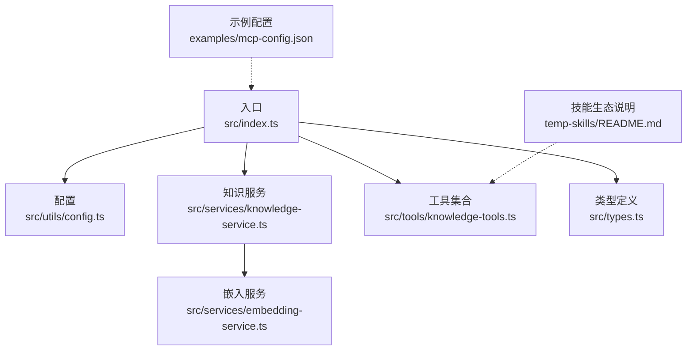
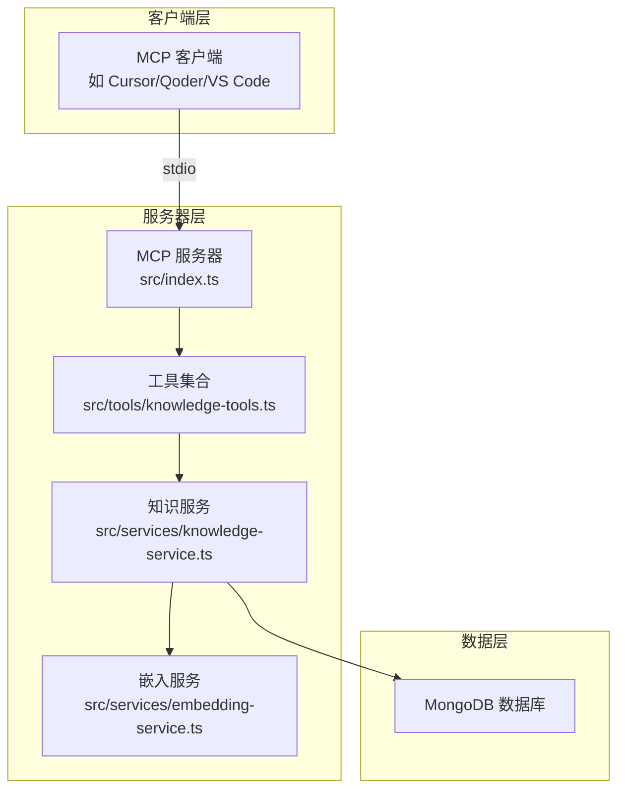
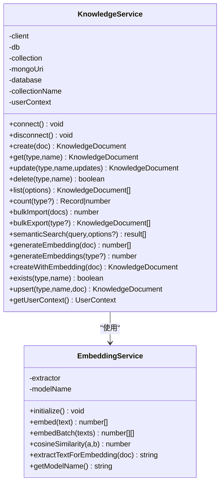
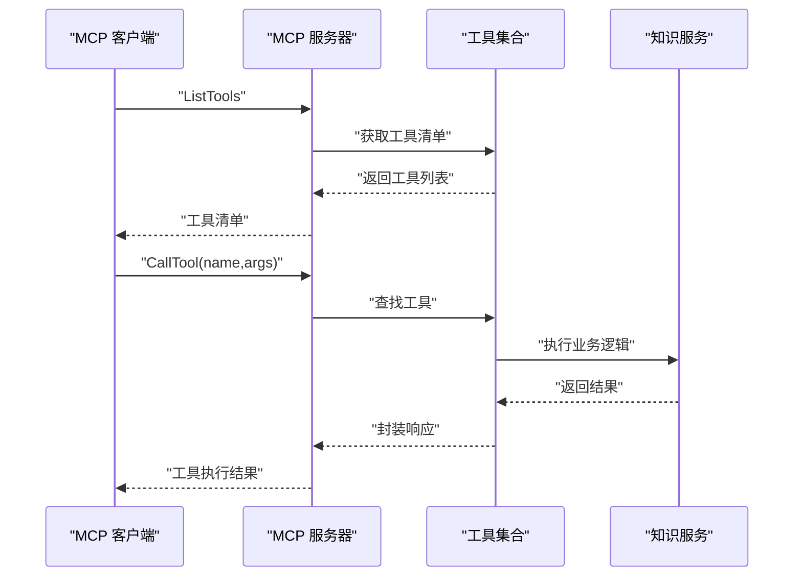
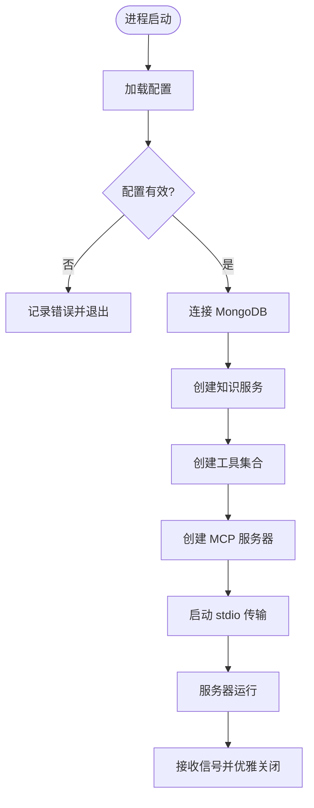
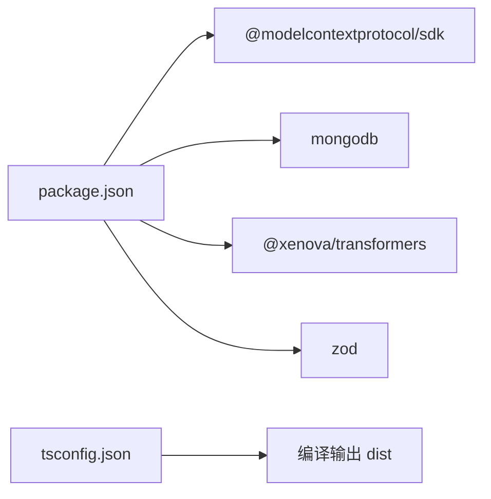

# 项目概述

<cite>
**本文引用的文件**
- [package.json](file://package.json)
- [tsconfig.json](file://tsconfig.json)
- [src/index.ts](file://src/index.ts)
- [src/types.ts](file://src/types.ts)
- [src/utils/config.ts](file://src/utils/config.ts)
- [src/services/knowledge-service.ts](file://src/services/knowledge-service.ts)
- [src/services/embedding-service.ts](file://src/services/embedding-service.ts)
- [src/tools/knowledge-tools.ts](file://src/tools/knowledge-tools.ts)
- [examples/mcp-config.json](file://examples/mcp-config.json)
- [temp-skills/README.md](file://temp-skills/README.md)
</cite>

## 目录
1. [简介](#简介)
2. [项目结构](#项目结构)
3. [核心组件](#核心组件)
4. [架构总览](#架构总览)
5. [详细组件分析](#详细组件分析)
6. [依赖分析](#依赖分析)
7. [性能考虑](#性能考虑)
8. [故障排查指南](#故障排查指南)
9. [结论](#结论)
10. [附录](#附录)

## 简介
MongoDB MCP Server 是一个基于 Model Context Protocol（MCP）协议的跨 IDE 知识库管理与工具服务器，通过 MongoDB 提供统一的知识存储与检索能力，并支持向量嵌入的语义搜索。项目旨在帮助开发者在不同 IDE（如 Cursor、Qoder、VS Code 等）中实现一致的知识库体验，涵盖记忆、技能、规则、MCP 配置、经验、命令、上下文、工作流等八类知识文档的全生命周期管理。

- 核心目标
  - 以 MCP 为标准协议，提供标准化的工具调用接口，便于与各类 AI 客户端集成。
  - 基于 MongoDB 实现知识的持久化、跨设备同步与版本控制。
  - 提供向量嵌入与语义搜索能力，提升知识检索的准确性与效率。
  - 支持多 IDE 源与用户/设备维度的隔离与同步。

- 主要特性
  - 八类知识文档模型与统一 CRUD 接口。
  - 用户上下文注入与跨设备同步机制。
  - 可选的向量嵌入与语义搜索工具链。
  - 丰富的快捷工具（记忆、经验、命令、上下文、规则、技能、工作流）。
  - 配置驱动的 MCP 服务器启动与日志记录。

- 适用场景
  - 多 IDE 开发者在不同终端间共享个人知识库。
  - 团队在云端数据库中共享规则、经验与工作流。
  - 需要语义检索的智能问答与自动化辅助场景。
  - 将外部 MCP 工具与本地知识库结合的扩展场景。

- 项目优势
  - 协议标准化：遵循 MCP 协议，易于与多种客户端集成。
  - 存储灵活：MongoDB 支持复杂查询、索引与扩展字段。
  - 搜索增强：可选的嵌入与相似度匹配，提高检索质量。
  - 易于扩展：模块化设计，新增知识类型与工具简单。

## 项目结构
项目采用按职责分层的组织方式，核心代码位于 src 目录，包含入口、类型定义、配置、服务与工具等模块；examples 提供 IDE 配置示例；temp-skills 展示了技能生态的参考实现。

图表来源
- [src/index.ts](file://src/index.ts#L1-L148)
- [src/utils/config.ts](file://src/utils/config.ts#L1-L147)
- [src/services/knowledge-service.ts](file://src/services/knowledge-service.ts#L1-L404)
- [src/tools/knowledge-tools.ts](file://src/tools/knowledge-tools.ts#L1-L1093)
- [src/services/embedding-service.ts](file://src/services/embedding-service.ts#L1-L148)
- [src/types.ts](file://src/types.ts#L1-L269)
- [examples/mcp-config.json](file://examples/mcp-config.json#L1-L94)
- [temp-skills/README.md](file://temp-skills/README.md#L1-L95)

章节来源
- [package.json](file://package.json#L1-L48)
- [tsconfig.json](file://tsconfig.json#L1-L21)
- [src/index.ts](file://src/index.ts#L1-L148)

## 核心组件
- 入口与服务器
  - 通过 MCP SDK 创建 stdio 传输的服务器，注册工具列表与工具调用处理器。
  - 在启动时加载配置、校验配置、连接 MongoDB、创建工具并启动服务器。
- 配置与日志
  - 从环境变量加载配置，支持 IDE 源、用户/设备标识、日志级别与嵌入开关。
  - 提供轻量日志工具，按级别输出调试信息。
- 知识服务
  - 封装 MongoDB 连接、索引、CRUD、批量导入导出、统计、语义搜索与嵌入生成。
  - 通过用户上下文过滤与注入，确保跨设备与跨 IDE 的数据隔离与同步。
- 嵌入服务
  - 基于 Transformers.js 的特征提取模型，提供懒加载、余弦相似度计算与文本抽取。
- 工具集合
  - 提供通用 CRUD、统计、批量导出、用户信息查询等基础工具。
  - 提供记忆、经验、命令、上下文、规则、技能、工作流等快捷工具。
  - 在启用嵌入时，追加语义搜索与嵌入生成工具。

章节来源
- [src/index.ts](file://src/index.ts#L1-L148)
- [src/utils/config.ts](file://src/utils/config.ts#L1-L147)
- [src/services/knowledge-service.ts](file://src/services/knowledge-service.ts#L1-L404)
- [src/services/embedding-service.ts](file://src/services/embedding-service.ts#L1-L148)
- [src/tools/knowledge-tools.ts](file://src/tools/knowledge-tools.ts#L1-L1093)

## 架构总览
系统采用“MCP 服务器 + MongoDB 存储 + 可选嵌入服务”的三层架构。MCP 客户端通过 stdio 与服务器交互，服务器根据请求路由到对应工具，工具委托知识服务进行数据操作，必要时调用嵌入服务生成向量。

图表来源
- [src/index.ts](file://src/index.ts#L1-L148)
- [src/tools/knowledge-tools.ts](file://src/tools/knowledge-tools.ts#L1-L1093)
- [src/services/knowledge-service.ts](file://src/services/knowledge-service.ts#L1-L404)
- [src/services/embedding-service.ts](file://src/services/embedding-service.ts#L1-L148)

## 详细组件分析

### 知识服务（KnowledgeService）
- 职责
  - 管理八类知识文档的生命周期：创建、读取、更新、删除、列表、统计、批量导入导出、存在性检查、Upsert。
  - 提供语义搜索与嵌入生成能力，支持按类型、标签、启用状态与关键词检索。
  - 通过用户上下文注入与过滤，实现跨设备与跨 IDE 的数据隔离与同步。
- 关键点
  - 索引策略：唯一索引（用户+类型+名称）、复合查询索引、标签与时间排序索引。
  - 同步版本：每次更新递增同步版本号，便于冲突检测与合并。
  - 嵌入流程：抽取文本 -> 生成向量 -> 写入文档 -> 余弦相似度排序。

图表来源
- [src/services/knowledge-service.ts](file://src/services/knowledge-service.ts#L1-L404)
- [src/services/embedding-service.ts](file://src/services/embedding-service.ts#L1-L148)

章节来源
- [src/services/knowledge-service.ts](file://src/services/knowledge-service.ts#L1-L404)

### 嵌入服务（EmbeddingService）
- 职责
  - 懒加载 Transformers.js 特征提取模型，提供文本向量化与批量向量化。
  - 计算余弦相似度，抽取文档文本片段用于嵌入。
- 性能与可用性
  - 首次初始化耗时较长，后续复用模型实例。
  - 支持批处理，适合大规模嵌入生成任务。

章节来源
- [src/services/embedding-service.ts](file://src/services/embedding-service.ts#L1-L148)

### 工具集合（KnowledgeTools）
- 职责
  - 提供 MCP 工具接口，封装知识库操作的输入校验与响应格式。
  - 包含通用 CRUD、统计、批量导出、用户信息查询等基础工具。
  - 提供记忆、经验、命令、上下文、规则、技能、工作流等快捷工具。
  - 在启用嵌入时，动态添加语义搜索与嵌入生成工具。
- 输入/输出规范
  - 统一返回结构：success、data 或 error、message、count 等字段。
  - 使用 Zod Schema 校验请求参数，保证工具调用的健壮性。

图表来源
- [src/index.ts](file://src/index.ts#L1-L148)
- [src/tools/knowledge-tools.ts](file://src/tools/knowledge-tools.ts#L1-L1093)
- [src/services/knowledge-service.ts](file://src/services/knowledge-service.ts#L1-L404)

章节来源
- [src/tools/knowledge-tools.ts](file://src/tools/knowledge-tools.ts#L1-L1093)

### 配置与日志（Config & Logger）
- 配置加载
  - 优先级：MCP 客户端传入 env > 系统环境变量 > 默认值。
  - 支持 IDE 源解析、布尔值解析、日志级别解析与设备 ID 生成。
- 日志
  - 按级别输出，便于在不同环境中调整可观测性。

章节来源
- [src/utils/config.ts](file://src/utils/config.ts#L1-L147)

### 类型与数据模型（Types）
- 知识类型
  - 八类知识文档：Memories、Skills、Rules、MCPs、Experiences、Commands、Contexts、Workflows。
- 文档结构
  - 统一字段：类型、名称、内容、描述、标签、启用状态、用户/设备/IDE 标识、同步版本、时间戳、向量嵌入等。
  - 各类型专属字段：如记忆的分类与重要性、经验的有效性评分、命令的模板与参数、上下文的作用域、工作流的步骤序列等。
- 查询与搜索
  - 列表查询支持类型、标签、启用状态、关键词搜索、分页。
  - 语义搜索支持类型过滤、阈值与数量限制。

章节来源
- [src/types.ts](file://src/types.ts#L1-L269)

### MCP 服务器启动流程

图表来源
- [src/index.ts](file://src/index.ts#L1-L148)
- [src/utils/config.ts](file://src/utils/config.ts#L1-L147)
- [src/services/knowledge-service.ts](file://src/services/knowledge-service.ts#L1-L404)

## 依赖分析
- 运行时依赖
  - @modelcontextprotocol/sdk：MCP 协议实现与传输抽象。
  - mongodb：MongoDB 官方驱动，提供连接、集合与索引管理。
  - @xenova/transformers：浏览器/Node 环境下的机器学习推理库，用于文本嵌入。
  - zod：类型验证与请求参数校验。
- 开发依赖
  - TypeScript、ESLint、TSX 等，支撑类型检查、代码风格与开发热重载。
- 脚本与引擎
  - Node >= 18，提供构建、启动、开发与类型检查脚本。

图表来源
- [package.json](file://package.json#L1-L48)
- [tsconfig.json](file://tsconfig.json#L1-L21)

章节来源
- [package.json](file://package.json#L1-L48)
- [tsconfig.json](file://tsconfig.json#L1-L21)

## 性能考虑
- 数据库层面
  - 合理使用索引：唯一索引与复合索引可显著提升 Upsert、查询与排序性能。
  - 分页与限制：列表查询支持 limit/offset，避免一次性返回大量数据。
  - 批量操作：批量导入导出与批量嵌入生成减少网络往返。
- 嵌入层面
  - 模型懒加载：首次初始化耗时较长，建议在空闲时段预热或提前触发。
  - 批量嵌入：对大批量文档生成嵌入时，使用批量接口降低开销。
- 服务器层面
  - 工具调用幂等：Upsert 与统计接口避免重复写入与多余查询。
  - 日志级别：生产环境建议提升日志级别，减少 IO 压力。

## 故障排查指南
- 启动失败
  - 检查配置：确认 MONGO_URI、MONGO_DATABASE、MONGO_COLLECTION 是否正确。
  - 日志定位：查看 INFO/ERROR 级别的日志输出，关注连接与工具加载阶段。
- 工具调用异常
  - 参数校验：核对工具输入 Schema，确保必填字段与枚举值正确。
  - 错误返回：工具统一返回 { success, error } 结构，优先查看 error 字段。
- 嵌入相关问题
  - 模型加载：首次加载可能耗时较长，等待初始化完成。
  - 相似度阈值：若语义搜索结果过少，适当降低阈值或增加 limit。
- 数据一致性
  - 同步版本：更新会递增 syncVersion，可用于冲突检测与合并策略。

章节来源
- [src/utils/config.ts](file://src/utils/config.ts#L1-L147)
- [src/tools/knowledge-tools.ts](file://src/tools/knowledge-tools.ts#L1-L1093)
- [src/services/knowledge-service.ts](file://src/services/knowledge-service.ts#L1-L404)

## 结论
MongoDB MCP Server 通过 MCP 协议与 MongoDB 存储，为开发者提供了一个可移植、可扩展、可搜索的知识库平台。其模块化设计与可选嵌入能力，使其既能满足个人开发者在多 IDE 间的知识同步需求，也能支撑团队在云端共享规则、经验与工作流。配合完善的工具集与日志体系，项目具备良好的可维护性与可观测性。

## 附录
- IDE 配置示例
  - 提供 Qoder、Cursor、VS Code、本地开发与云数据库共享等配置样例，便于快速接入。
- 技能生态参考
  - temp-skills 目录展示了技能的组织方式与元数据规范，有助于理解 Agent Skills 标准与扩展思路。

章节来源
- [examples/mcp-config.json](file://examples/mcp-config.json#L1-L94)
- [temp-skills/README.md](file://temp-skills/README.md#L1-L95)